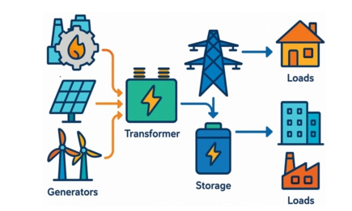
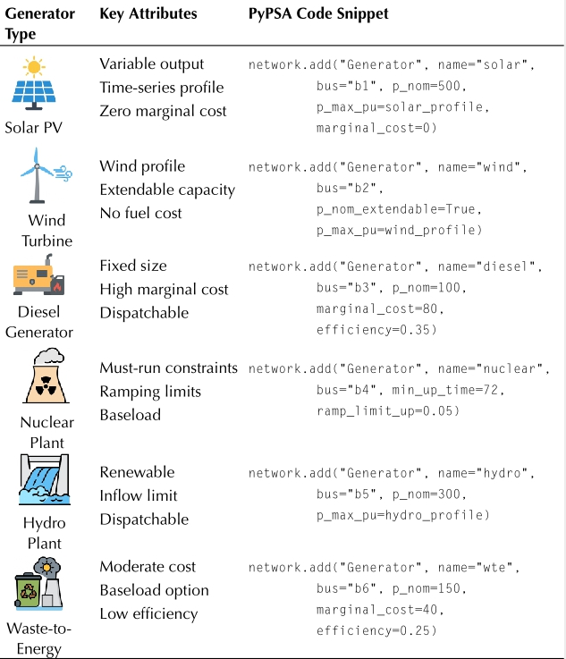
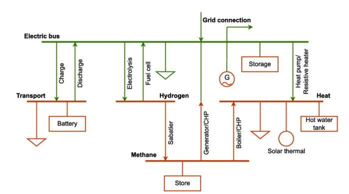

# 3.2 Modeling components in PyPSA

### Τα βασικά στοιχεία ενός συστήματος ισχύος που χρησιμοποιεί PyPSA
---
> <p style="text-align: justify;"> Η Εικόνα 3.1 απεικονίζει τη ροή της ηλεκτρικής ενέργειας ξεκινώντας από τις γεννήτριες, οι οποίες περιλαμβάνουν διάφορους τύπους, όπως ανεμογεννήτριες, ηλιακούς συλλέκτες και μονάδες συμπαραγωγής. Αυτές οι γεννήτριες συνδέονται με έναν μετασχηματιστή. Ο μετασχηματιστής συνδέεται με έναν πύργο μεταφοράς, ο οποίος στη συνέχεια συνδέεται με την μπαταρία. Από την μπαταρία, η ηλεκτρική ενέργεια διανέμεται σε διαφορετικούς καταναλωτές (Φορτία/Loads), συμπεριλαμβανομένων κατοικιών, εμπορικών κτιρίων και βιομηχανικών εγκαταστάσεων. <p>


<div class="container">
  
</div>

* <p style="text-align: justify;"> Η ανάλυση και ο σχεδιασμός των σύγχρονων δικτύων ενέργειας απαιτούν τη λεπτομερή μοντελοποίηση των φυσικών τους στοιχείων. Μέσω του PyPSA, οι γεννήτριες, οι μετασχηματιστές και τα συστήματα αποθήκευσης ορίζονται ως διακριτές μονάδες, επιτρέποντας την αξιολόγηση της σταθερότητας του συστήματος και τη διαχείριση των διακυμάνσεων από τις ανανεώσιμες πηγές. Αυτή η δομημένη προσέγγιση διασφαλίζει τη συνέπεια των τεχνικών δεδομένων και την αξιοπιστία των αποτελεσμάτων της προσομοίωσης.</p>


## 3.1.2 Βασικά στοιχεία και λειτουργίες τους

| Συστατικό (Component) | Τι Αντιπροσωπεύει στο Δίκτυο | Βασική Παράμετρος | Μονάδα Μέτρησης |
|:----------|:--------:|:----------|:--------:|
|**Bus** (Ζυγός/Κόμβος)|Το σημείο σύνδεσης των υπολοίπων στοιχείων|Ονομαστική Τάση (**v_nom**)|kV (Κιλοβόλτ)
|**Generator** (Γεννήτρια)|Παραγωγή ενέργειας (Συμβατική ή ΑΠΕ)|Ονομαστική Ισχύς (**p_nom**)|MW (Μεγαβάτ)|
|**Load** (Φορτίο/Ζήτηση)|Η κατανάλωση ενέργειας από τους χρήστες|Ενεργός Ισχύς (**p_set**)|MW (Μεγαβάτ)|
|**Line** (Γραμμή Μεταφοράς)|Καλώδια AC που ενώνουν ζυγούς (μεταφορά)| Μήκος (**length**)  Χωρητικότητα (**s_nom**) |  km (Χιλιόμετρα) MVA (Μεγαβολταμπέρ)*|
|**Transformer** (Μετασχηματιστής)|Αλλάζει το επίπεδο τάσης μεταξύ δύο ζυγών|Φαινόμενη Ισχύς (**s_nom**)|MVA (Μεγαβολταμπέρ)*|
|**Link** (Σύνδεσμος)|"Σύνδεση με κατεύθυνση, π.χ. καλώδιο DC ή μετατροπέας."|Ονομαστική Ισχύς (**p_nom**)|MW (Μεγαβάτ)|
|**Storage Unit** (Μονάδα Αποθήκευσης)|"Μπαταρίες, αντλησιοταμίευση (αποθήκευση & έγχυση)"|Ισχύς (**p_nom**)  Ενέργεια (**max_hours**)|MW -   Ώρες (**Άρα MW × h = MWh**)|
|**Store** (Αποθήκη)|Αποθήκευση καθαρής ενέργειας ή υλικών (π.χ. Υδρογόνο)|Χωρητικότητα (**e_nom**)|MWh (**Μεγαβατώρες**)
**Carrier** (Φορέας Ενέργειας)|"Το είδος ενέργειας (π.χ. AC, DC, gas, wind)"|Εκπομπές CO2 (**co2_emissions**)|tCO2 / MWh (**Τόνοι ανά MWh**)
---
**Σημείωση: Για τις γραμμές (Lines) και τους μετασχηματιστές (Transformers), η χωρητικότητα μετριέται σε MVA (Φαινόμενη Ισχύς) γιατί στα δίκτυα εναλλασσόμενου ρεύματος (AC) λαμβάνεται υπόψη και η άεργος ισχύς, όχι μόνο η πραγματική (MW)*


[Extras](extras.md#Volt)


### 1. Οριακό Κόστος (Marginal Cost)

>Το οριακό κόστος αντιπροσωπεύει τη δαπάνη για την παραγωγή μίας επιπλέον μονάδας ενέργειας (συνήθως ανά MWh).

* Σύνθεση: Περιλαμβάνει μεταβλητά έξοδα, όπως το κόστος καυσίμου, τα δικαιώματα εκπομπών CO2 και τα μεταβλητά έξοδα συντήρησης.

* Ρόλος στο PyPSA: Καθορίζει τη σειρά προτεραιότητας (Merit Order). Το μοντέλο επιλέγει να λειτουργήσει πρώτα τις μονάδες με το χαμηλότερο οριακό κόστος (π.χ. ΑΠΕ, όπου το κόστος είναι σχεδόν μηδενικό) για να καλύψει τη ζήτηση.

* **Παράμετρος: Στο PyPSA ορίζεται ως marginal_cost.** 

### Κεφαλαιουχικό Κόστος (Capital Cost)

Το κεφαλαιουχικό κόστος αφορά την αρχική επένδυση για την κατασκευή και εγκατάσταση μιας υποδομής.

* Σύνθεση: Περιλαμβάνει το κόστος αγοράς εξοπλισμού, την εγκατάσταση και τα σταθερά έξοδα λειτουργίας (Fixed O&M). Για τη σύγκριση διαφορετικών τεχνολογιών, το κόστος αυτό συνήθως ετησιοποιείται (annuitized) με βάση τη διάρκεια ζωής του έργου και το επιτόκιο προεξόφλησης.

* Ρόλος στο PyPSA: Επηρεάζει τις αποφάσεις επέκτασης ισχύος (Capacity Expansion). Το μοντέλο θα «χτίσει» νέα ισχύ μόνο αν το κεφαλαιουχικό κόστος της μονάδας δικαιολογείται από τη μακροπρόθεσμη εξοικονόμηση που θα προσφέρει στο σύστημα.

* **Παράμετρος: Στο PyPSA ορίζεται ως capital_cost και ενεργοποιείται όταν η παράμετρος p_nom_extendable είναι True.**

---
## 3.2 Λεπτομερής μοντελοποίηση των στοιχείων του συστήματος ηλεκτρικής ενέργειας

### 3.2.1 Buses

* <p style="text-align: justify;"> Η τοπολογία ενός ενεργειακού συστήματος στο PyPSA εδράζεται στο σύστημα των ζυγών, οι οποίοι αποτελούν το πλαίσιο διασύνδεσης της φυσικής υποδομής. Κάθε ζυγός χαρακτηρίζεται από το επίπεδο τάσης και τον τύπο του ρεύματος (AC ή DC), καθορίζοντας τον λειτουργικό του ρόλο στο δίκτυο μεταφοράς ή διανομής. Ως κεντρικά σημεία αναφοράς για τον υπολογισμό των ηλεκτρικών μεγεθών σε μόνιμη κατάσταση, οι ζυγοί επιτρέπουν τη λεπτομερή χαρτογράφηση της κατανομής της ισχύος και την αξιολόγηση της απόκρισης του συστήματος σε διαταραχές, αποτελώντας τη βάση πάνω στην οποία δομείται κάθε περαιτέρω ανάλυση. </p>


# 1. BUSES (Ζυγοί)
# Ορίζουμε δύο ζυγούς: έναν για την παραγωγή και έναν για την κατανάλωση
network.add("Bus", "MyBus_HighVoltage", v_nom=380, x=0.0, y=0.0)
network.add("Bus", "MyBus_LowVoltage", v_nom=20, x=0.0, y=1.0)
```
---

### 3.2.2 Generators
* <p style="text-align: justify;">Η μοντελοποίηση της παραγωγής στο PyPSA διακρίνεται στην αναπαράσταση σταθερών και μεταβλητών πηγών ενέργειας. Για τις συμβατικές μονάδες, η έμφαση δίνεται στους οικονομικούς και τεχνικούς περιορισμούς που διέπουν τη λειτουργία τους, εξασφαλίζοντας την αξιοπιστία του συστήματος και την παροχή ισχύος βάσης. Αντίθετα, για τις τεχνολογίες αιολικής και ηλιακής ενέργειας, το μοντέλο ενσωματώνει τη στοχαστικότητα της παραγωγής μέσω χρονοσειρών διαθεσιμότητας. Αυτή η διαφοροποίηση επιτρέπει τη μελέτη σύνθετων συστημάτων, όπως οι μονάδες Power-to-X, και την αξιολόγηση της επάρκειας ισχύος υπό συνθήκες υψηλής διείσδυσης ανανεώσιμων πηγών.</p>

```py
# 2. GENERATORS (Γεννήτριες)
# Συμβατική μονάδα (π.χ. Φυσικό Αέριο) με οριακό κόστος και δυνατότητα επέκτασης
network.add("Generator", "Gas_Turbine",
            bus="MyBus_HighVoltage",
            p_nom=100,              # Ονομαστική ισχύς σε MW
            marginal_cost=50,       # Μεταβλητό κόστος σε €/MWh
            capital_cost=1000,      # Κόστος επένδυσης (annuitized) σε €/MW
            p_nom_extendable=True,  # Επιτρέπει στο μοντέλο να αυξήσει την ισχύ
            efficiency=0.4)         # Απόδοση μονάδας

# Ανανεώσιμη πηγή (π.χ. Φωτοβολταϊκό) με χρονικά μεταβαλλόμενη διαθεσιμότητα (p_max_pu)
network.add("Generator", "Solar_PV",
            bus="MyBus_HighVoltage",
            p_nom=50,
            marginal_cost=0.01,
            p_max_pu=[0.1, 0.5, 0.8, 0.2], # Διαθεσιμότητα ανά χρονικό βήμα (pu)
            capital_cost=500)
```

<div class="container">
  
</div>

---
### 3.2.2 Loads

* <p style="text-align: justify;">Το PyPSA παρέχει ένα ευέλικτο πλαίσιο για την προσομοίωση της ζήτησης, επιτρέποντας την ενσωμάτωση σύνθετων προφίλ φορτίου που ανταποκρίνονται στις σύγχρονες ενεργειακές προκλήσεις. Η μοντελοποίηση δεν περιορίζεται στην απλή καταγραφή της κατανάλωσης, αλλά επεκτείνεται στην ανάλυση της στοχαστικότητας και των προβλέψιμων τάσεων που προκύπτουν από τη χρήση έξυπνων συσκευών και τη διαχείριση της πλευράς της ζήτησης. Συνδυάζοντας τη μοντελοποίηση παραγωγής και φορτίου, το εργαλείο προσφέρει τη βάση για μελέτες επάρκειας ισχύος και επιχειρησιακών οικονομικών, υποστηρίζοντας τον σχεδιασμό ανθεκτικών συστημάτων που μπορούν να ανταπεξέλθουν τόσο σε κανονικές όσο και σε ακραίες καταστάσεις λειτουργίας. </p>

```py
# 3. LOADS (Φορτία)
# Προσθήκη ζήτησης στον ζυγό χαμηλής τάσης
network.add("Load", "City_Load",
            bus="MyBus_LowVoltage",
            p_set=[40, 60, 80, 50]) # Ζήτηση σε MW ανά χρονική στιγμή
```
---
### 3.2.3 Transmission lines

* <p style="text-align: justify;"> Το δίκτυο μεταφοράς στο PyPSA δεν αντιμετωπίζεται ως μια απλή διασύνδεση, αλλά ως μια φυσική υποδομή με συγκεκριμένους τεχνικούς περιορισμούς που διαμορφώνουν τη λειτουργία της αγοράς και την ευστάθεια του συστήματος. Η ενσωμάτωση της σύνθετης αντίστασης και των ορίων ισχύος επιτρέπει τη διεξαγωγή αξιόπιστων αναλύσεων ροής φορτίου και τον εντοπισμό κρίσιμων σημείων του δικτύου. Καθώς το ενεργειακό μείγμα μεταβάλλεται προς την αποκεντρωμένη παραγωγή από ΑΠΕ, η ικανότητα του μοντέλου να προσομοιώνει σενάρια αναβάθμισης και στρατηγικών επενδύσεων καθίσταται θεμελιώδης για τον σχεδιασμό ενός εύκαμπτου και στιβαρού ηλεκτρικού συστήματος. </p>

```py
network.add("Line", "Main_Line",
            bus0="MyBus_HighVoltage",
            bus1="MyBus_HighVoltage_2", # Θα έπρεπε να έχει οριστεί αντίστοιχος ζυγός
            r=0.01,                 # Αντίσταση (Ohm)
            x=0.1,                  # Επαγωγική αντίδραση (Ohm)
            s_nom=200)              # Φαινόμενη ισχύς (MVA)
```

### 3.2.4 Transformers

* <p style="text-align: justify;"> Η διασύνδεση των διαφορετικών επιπέδων τάσης στο PyPSA υλοποιείται μέσω των μετασχηματιστών, οι οποίοι καθορίζουν την αποτελεσματικότητα της μεταφοράς και τη σταθερότητα του συστήματος. Η μοντελοποίησή τους περιλαμβάνει κρίσιμους περιορισμούς ισχύος και ηλεκτρικές παραμέτρους που επηρεάζουν άμεσα τις απώλειες του δικτύου και τη συμπεριφορά της τάσης στους ζυγούς. Η ενσωμάτωση της ονομαστικής ισχύος και της σύνθετης αντίστασης των μετασχηματιστών επιτρέπει στο PyPSA να προσομοιώνει ρεαλιστικά τις ροές ενέργειας, διασφαλίζοντας ότι το σύστημα παραμένει εντός των ασφαλών ορίων λειτουργίας τόσο στον μακροπρόθεσμο σχεδιασμό όσο και στην επιχειρησιακή ανάλυση. </p>


```py
network.add("Line", "Main_Line",
            bus0="MyBus_HighVoltage",
            bus1="MyBus_HighVoltage_2", # Θα έπρεπε να έχει οριστεί αντίστοιχος ζυγός
            r=0.01,                 # Αντίσταση (Ohm)
            x=0.1,                  # Επαγωγική αντίδραση (Ohm)
            s_nom=200)              # Φαινόμενη ισχύς (MVA)
```


### 3.2.5 Storage units
* <p style="text-align: justify;">Οι μονάδες αποθήκευσης λειτουργούν ως ευέλικτοι διαμεσολαβητές μεταξύ παραγωγής και κατανάλωσης, επιτρέποντας τη μετατόπιση ενέργειας (energy shifting) και την περικοπή των αιχμών φορτίου (peak shaving). Μέσω του PyPSA, η μοντελοποίηση της αποθήκευσης λαμβάνει υπόψη τις απώλειες μετατροπής και τους τεχνικούς περιορισμούς κύκλου ζωής, προσφέροντας μια ολοκληρωμένη εικόνα της συνεισφοράς τους στη σταθερότητα του δικτύου. Η δυνατότητα αλληλεπίδρασης των μονάδων αποθήκευσης με τις υπόλοιπες συνιστώσες του συστήματος είναι απαραίτητη για κάθε σύγχρονο μοντέλο σχεδιασμού, ειδικά σε σενάρια υψηλής διείσδυσης ανανεώσιμων πηγών, όπου η ανάγκη για εφεδρείες και ευελιξία είναι αυξημένη.</p>


```py
# 6. STORAGE UNITS (Μονάδες Αποθήκευσης)
# Προσθήκη μπαταρίας με ενεργειακή χωρητικότητα και απόδοση
network.add("StorageUnit", "Battery_System",
            bus="MyBus_LowVoltage",
            p_nom=20,               # Μέγιστη ισχύς φόρτισης/εκφόρτισης (MW)
            max_hours=4,            # Χωρητικότητα σε ώρες (p_nom * max_hours = e_nom)
            efficiency_store=0.9,   # Απόδοση φόρτισης
            efficiency_dispatch=0.9, # Απόδοση εκφόρτισης
            state_of_charge_initial=10) # Αρχική φόρτιση σε MWh
```

### 3.2.6 System-level view of PyPSA components

<div class="container">
  
</div>

### Μοντελοποίηση Πολυτομεακών Συστημάτων και Μετατροπής Ενέργειας
 <p style="text-align: justify;">Η αρχιτεκτονική του εξεταζόμενου συστήματος βασίζεται στην ολοκληρωμένη διαχείριση διαφορετικών ενεργειακών φορέων, με κεντρικό σημείο αναφοράς έναν Ηλεκτρικό Ζυγό (Electric Bus). Το σύστημα ενσωματώνει προηγμένες τεχνολογίες αποθήκευσης και μετατροπής, επιτρέποντας την αμφίδρομη ροή ενέργειας μεταξύ του ηλεκτρικού δικτύου και των τομέων της θέρμανσης και των καυσίμων.</p>

#### 1. Συστήματα Αποθήκευσης και Power-to-Gas (P2G)

Η ηλεκτρική ενέργεια μπορεί να αποθηκευτεί βραχυπρόθεσμα σε συστοιχίες συσσωρευτών (Batteries) μέσω διαδικασιών φόρτισης και εκφόρτισης. Για μακροπρόθεσμη αποθήκευση, το σύστημα χρησιμοποιεί την τεχνολογία Power-to-Gas:

* Ηλεκτρόλυση: Μετατροπή της ηλεκτρικής ενέργειας σε Υδρογόνο (H2​).
* Μεθανοποίηση (Sabatier): Χημική επεξεργασία του υδρογόνου για την παραγωγή συνθετικού Μεθανίου (CH4​), το οποίο αποθηκεύεται σε δεξαμενές.
* Επαναεριοποίηση: Η ανάκτηση της ηλεκτρικής ενέργειας από το υδρογόνο επιτυγχάνεται μέσω κυψελών καυσίμου (Fuel Cells).

#### 2. Σύζευξη Ηλεκτρισμού και Θερμότητας (Power-to-Heat)

Ο τομέας της θέρμανσης τροφοδοτείται από πολλαπλές πηγές, ενισχύοντας την ευελιξία του συστήματος:
* Αντλίες Θερμότητας και Αντιστάσεις: Μετατρέπουν το πλεόνασμα ηλεκτρικής ενέργειας σε θερμική.
* Συμπαραγωγή Ηλεκτρισμού και Θερμότητας (CHP): Μονάδες παραγωγής και λέβητες χρησιμοποιούν το αποθηκευμένο υδρογόνο για την ταυτόχρονη κάλυψη ηλεκτρικών και θερμικών φορτίων.
* Θερμική Αποθήκευση: Η παραγόμενη θερμότητα, σε συνδυασμό με τη συμβολή ηλιοθερμικών συστημάτων, αποθηκεύεται σε δεξαμενές ζεστού νερού (Thermal Storage) για μετέπειτα χρήση.

#### 3. Στρατηγική Σημασία της Διασύνδεσης

<p style="text-align: justify;">Η δομή αυτή επιτρέπει τη βελτιστοποίηση της λειτουργίας του συστήματος, ειδικά σε περιβάλλον υψηλής διείσδυσης ανανεώσιμων πηγών. Η δυνατότητα μετατροπής του ηλεκτρισμού σε αέριο ή θερμότητα μειώνει τις περικοπές παραγωγής (curtailment) και προσφέρει πολύτιμες υπηρεσίες εξισορρόπησης στο δίκτυο, διασφαλίζοντας την ενεργειακή επάρκεια μέσω της αξιοποίησης της αποθηκευμένης ενέργειας σε περιόδους χαμηλής παραγωγής. </p>


---

[ΚΕΦΑΛΑΙΟ 3.3](chapter3.3.md)