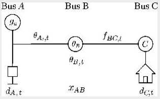

# 3.3 Performing power flow analysis

> 
Η ανάλυση ροών ισχύος (power flow analysis) αποτελεί θεμελιώδες εργαλείο τόσο για την επιχειρησιακή λειτουργία όσο και για τον μακροπρόθεσμο σχεδιασμό των συστημάτων ηλεκτρικής ενέργειας. Παρέχει μια ολοκληρωμένη απεικόνιση της κίνησης της ηλεκτρικής ενέργειας στο δίκτυο υπό συνθήκες μόνιμης κατάστασης, προσδιορίζοντας τα μεγέθη των τάσεων στους ζυγούς, τις εγχύσεις ισχύος από τις γεννήτριες και τις μεταφορές ενέργειας μέσω των διαδρόμων μεταφοράς. Μέσω αυτής της ηλεκτρικής αποτύπωσης, οι διαχειριστές μπορούν να αξιολογήσουν εάν το δίκτυο λειτουργεί εντός των τεχνικών ορίων ασφαλείας και να ανταποκριθούν στη μεταβαλλόμενη ζήτηση, στα μεταβαλλόμενα προφίλ παραγωγής και στις δομικές αλλαγές των υποδομών. Η γνώση αυτή είναι απαραίτητη όχι μόνο για την καθημερινή διαχείριση, αλλά και για τη διασφάλιση της συμμόρφωσης με τους κανονισμούς, τον προγραμματισμό επέκτασης παγίων και τη διαχείριση της αξιοπιστίας του συστήματος.

## 3.3.1 Purpose of power flow analysis

 Η ανάλυση ροής ισχύος αποτελεί το θεμελιώδες διαγνωστικό εργαλείο για την αξιολόγηση της στατικής ευστάθειας ενός δικτύου. Μέσω της επίλυσης του συστήματος των εξισώσεων του δικτύου σε κατάσταση ισορροπίας, καθίσταται δυνατός ο ακριβής προσδιορισμός των τάσεων στους ζυγούς και των φορτίσεων στις γραμμές μεταφοράς. Η μελέτη αυτή είναι κρίσιμη για τη διασφάλιση της ασφάλειας N−1, την αποφυγή συμφορήσεων και τον στρατηγικό σχεδιασμό υποδομών, διασφαλίζοντας ότι το σύστημα παραμένει εντός των τεχνικών ορίων λειτουργίας και των προτύπων αξιοπιστίας, ακόμη και υπό συνθήκες υψηλής στοχαστικής παραγωγής από ΑΠΕ

## 3.3.2 Basics of the power flow process

 Η φυσική ευστάθεια και η αξιοπιστία των μοντέλων στο PyPSA διασφαλίζονται μέσω της ενσωμάτωσης των δύο θεμελιωδών νόμων του Kirchhoff, οι οποίοι μετατρέπονται σε μαθηματικούς περιορισμούς (constraints) κατά τη διαδικασία της βελτιστοποίησης.

[Extras](extras.md#acdc)
---
### Kirchhoff's Laws and Power Flow in PyPSA 

#### 1. Πρώτος Νόμος του Kirchhoff (KCL) – Ισοζύγιο Ισχύος 
>*Ο νόμος αυτός επιβάλλει τη διατήρηση της ενέργειας σε κάθε ζυγό (bus) του συστήματος. Σύμφωνα με τον KCL, το άθροισμα των ρευμάτων (ή της ισχύος) που εισέρχονται σε έναν κόμβο πρέπει να ισούται με το άθροισμα αυτών που εξέρχονται.*

 Ο Νόμος των Ρευμάτων (Κανόνας του Κόμβου)
Αυτός ο νόμος λέει, πολύ απλά, ότι το ρεύμα δεν χάνεται.
- Η ιδέα: Αν έχεις έναν «κόμβο» (ένα σημείο όπου ενώνονται πολλά καλώδια), όσο ρεύμα μπαίνει, άλλο τόσο πρέπει να βγαίνει.
- Παρομοίωση: Σκέψου μια διασταύρωση σωλήνων νερού. Αν μπουν 10 λίτρα το δευτερόλεπτο στη διασταύρωση, πρέπει οπωσδήποτε να βγουν 10 λίτρα από τις άλλες εξόδους. Δεν μπορεί να εξαφανιστεί νερό μέσα στον σωλήνα.
- Με δυο λόγια: Άθροισμα ρευμάτων που μπαίνουν = Άθροισμα ρευμάτων που βγαίνουν.

 

---
### 
 gA,t​−dA,t​=fAB,t​ 

---
- gA,t​: Η παραγωγή (generation) στον ζυγό A.
- dA,t​: Η ζήτηση (demand/load) στον ζυγό A.
- fAB,t​: Η ροή ισχύος (flow) προς τη συνδεδεμένη γραμμή AB.

* Με απλά λόγια: Η καθαρή έγχυση ισχύος σε έναν κόμβο (παραγωγή μείον κατανάλωση) πρέπει να είναι ακριβώς ίση με την ισχύ που "φεύγει" μέσω των γραμμών μεταφοράς. *
---
#### 2. Ο δεύτερος νόμος αναφέρεται στον Νόμο Τάσεων του Kirchhoff (KVL), 
> O οποίος στην πλήρη μορφή του λέει ότι σε ένα κλειστό κύκλωμα, το άθροισμα των τάσεων είναι μηδέν. Στο PyPSA, όταν κάνουμε Γραμμική Βελτιστοποίηση (LOPF - Linear Optimal Power Flow), χρησιμοποιούμε μια απλοποιημένη εκδοχή αυτού του νόμου.

Αυτός ο νόμος αφορά την ενέργεια (την τάση) που παίρνει και δίνει το ρεύμα καθώς κάνει μια βόλτα στο κύκλωμα.

* Η ιδέα: Σε μια κλειστή διαδρομή (έναν κύκλο), η ενέργεια που δίνει η μπαταρία καταναλώνεται πλήρως από τις συσκευές (αντιστάσεις, λάμπες κλπ.) που συναντά το ρεύμα.
* Παρομοίωση: Φαντάσου ένα roller coaster. Η μηχανή (μπαταρία) σε ανεβάζει σε ένα ύψος (τάση). Καθώς η διαδρομή προχωράει και περνάς από στροφές και κατηφόρες (αντιστάσεις), χάνεις αυτό το ύψος. Όταν επιστρέψεις στην αφετηρία, το ύψος σου είναι πάλι μηδέν.
* Με δυο λόγια: Η τάση που προσφέρει η πηγή ισούται με το άθροισμα των τάσεων που «τρώνε» τα εξαρτήματα του κυκλώματος.

---
### 
 fAB,t​=​(θA,t​−θB,t​)/xAB​​ 

---
1. Στους Κόμβους (Ζυγοί / Buses)
* gA,t​: Η παραγωγή (generation) της γεννήτριας στον κόμβο A τη χρονική στιγμή t (π.χ. τα MW που βγάζει το φωτοβολταϊκό).
* dA,t​, dC,t​: Η ζήτηση (demand/load) για ρεύμα στους κόμβους A και C τη στιγμή t (π.χ. πόσα MW τραβάει η πόλη).
* θA,t​,θB,t​,θC,t​: Οι γωνίες φάσης της τάσης (voltage phase angles) σε κάθε κόμβο. Το μοντέλο τις υπολογίζει αυτόματα για να βρει προς τα πού "σπρώχνεται" το ρεύμα.

2. Στις Γραμμές Μεταφοράς (Lines)
* fAB,t​, fBC,t​: Η ροή ισχύος (power flow) πάνω στα καλώδια που ενώνουν το A με το B, και το B με το C. (Μετριέται σε MW).
* xAB​: Η αντίσταση (reactance) της γραμμής A-B. Είναι μια φυσική ιδιότητα του καλωδίου (εξαρτάται από το υλικό και το πάχος του) που εμποδίζει το εναλλασσόμενο ρεύμα να περάσει ελεύθερα.

 

  

  

---

  
|Χαρακτηριστικό	|Bus (Κόμβος)	|Line (Γραμμή)
|:-------| :----:|:------:|
|Ρόλος|	Σημείο συγκέντρωσης ενέργειας.|	Μέσο μεταφοράς ενέργειας.|
|Σύνδεση|	Συνδέεται με τα πάντα (Gen, Load, Line).|	Συνδέει πάντα δύο Bus μεταξύ τους.||
Μαθηματικά|	Εφαρμόζει τον 1ο Νόμο Kirchhoff (∑I=0).|	Εφαρμόζει τον 2ο Νόμο Kirchhoff (ΔV=I⋅Z).|
|Παράδειγμα	|"Υποσταθμός Αθήνας".|"Γραμμή Αθήνα - Θεσσαλονίκη".|

---

Tο διάγραμμα απεικονίζει ένα απλό δίκτυο με τρεις σταθμούς (Κόμβους/Buses) και μας δείχνει πώς μεταφέρεται η ενέργεια.

Ας το δούμε σπασμένο στα βασικά του κομμάτια:
1. Οι Κόμβοι (Buses)

    Κόμβος Α (Bus A): Είναι ένας κόμβος παραγωγής και κατανάλωσης. Διαθέτει μια μονάδα παραγωγής (η γεννήτρια gA,t​) που εγχέει ρεύμα, αλλά και μια τοπική ζήτηση (το φορτίο dA,t​) που τραβάει ρεύμα. Η ηλεκτρική του κατάσταση περιγράφεται από τη γωνία φάσης της τάσης θA,t​.

    Κόμβος Β (Bus B): Λειτουργεί ως ενδιάμεσος σταθμός μεταφοράς (transit node). Η δική του γωνία τάσης σημειώνεται ως θB,t​.

    Κόμβος C (Bus C): Έχει και αυτός τοπική ζήτηση για ρεύμα (το φορτίο dC,t​) και διαθέτει ένα επιπλέον στοιχείο "C" (που σε τέτοια διαγράμματα συνήθως υποδηλώνει άλλη μια γεννήτρια ή κάποιο σύστημα αποθήκευσης).

2. Οι Γραμμές Μεταφοράς (Lines)

    Γραμμή Α-Β (Από τον Κόμβο Α στον Β): Πάνω σε αυτή τη σύνδεση σημειώνεται η αντίδραση xAB​. Αυτή είναι η φυσική "αντίσταση" του καλωδίου. Όπως είδαμε στον μαθηματικό τύπο του KVL προηγουμένως, η ροή ενέργειας σε αυτό το σημείο καθορίζεται από τη διαφορά των γωνιών (θA,t​−θB,t​) και το πόσο "στενό" είναι το καλώδιο (xAB​).

    Γραμμή Β-C (Από τον Κόμβο Β στον C): Εδώ η περιγραφή εστιάζει στη μεταβλητή της ροής ισχύος fBC,t​. Αυτό μας δείχνει καθαρά το πόσα MW ρεύματος ταξιδεύουν εκείνη τη συγκεκριμένη χρονική στιγμή t από τον σταθμό Β προς τον σταθμό C.

Ποια είναι η συνολική εικόνα;
Το διάγραμμα σου δείχνει οπτικά ένα πρόβλημα βελτιστοποίησης. Αν η ζήτηση στον Κόμβο C (dC,t​) είναι μεγάλη και η γεννήτρια στον Κόμβο Α (gA,t​) παράγει περίσσεια ενέργειας, το ρεύμα θα πρέπει να ταξιδέψει από το Α στο Β, και μετά από το Β στο C. Το PyPSA (χρησιμοποιώντας τον τύπο που είδαμε) υπολογίζει αυτόματα τις γωνίες θ και τις ροές f για να βεβαιωθεί ότι το ρεύμα φτάνει στον προορισμό του χωρίς να υπερφορτωθούν τα καλώδια.

---

### Ταξινόμηση Ζυγών στην Ανάλυση Ροής Ισχύος: PQ, PV και Slack

Στην ανάλυση συστημάτων ισχύος, οι ζυγοί κατηγοριοποιούνται ανάλογα με τις παραμέτρους που ορίζονται ως είσοδοι και εκείνες που προκύπτουν ως αποτελέσματα της επίλυσης. Παρόλο που το PyPSA αντιμετωπίζει τους ζυγούς ως γενικά σημεία διασύνδεσης, η κατανόηση των παρακάτω τύπων είναι απαραίτητη για την επίλυση AC ή DC ροών ισχύος.

#### 1. Ζυγός PQ (Ζυγός Φορτίου)

Σε έναν ζυγό PQ, η πραγματική ισχύς (P) και η άεργος ισχύς (Q) είναι προκαθορισμένες (δεδομένα εισόδου). Συνήθως αντιπροσωπεύουν σημεία ζήτησης ή παθητικούς κόμβους.
-  Γνωστά: P,Q
- Άγνωστα: Μέτρο τάσης (∣V∣) και γωνία τάσης (θ).
- Οι ζυγοί PQ αποτελούν την πλειονότητα των κόμβων στα συστήματα διανομής.

#### 2. Ζυγός PV (Ζυγός Γεννήτριας)

Σε έναν ζυγό PV, η πραγματική ισχύς (P) και το μέτρο της τάσης (∣V∣) είναι γνωστά, καθώς καθορίζονται από την έξοδο της γεννήτριας και το σημείο ρύθμισης της τάσης (voltage setpoint).
- Γνωστά: P,∣V∣
- Άγνωστα: Άεργος ισχύς (Q) και γωνία τάσης (θ).
- Αντιπροσωπεύουν μονάδες παραγωγής με δυνατότητα ρύθμισης τάσης.

#### 3. Ζυγός Slack (Ζυγός Αναφοράς)

Κάθε σύστημα ισχύος απαιτεί έναν ζυγό αναφοράς (slack ή swing bus), ο οποίος χρησιμεύει ως το σημείο αναφοράς για τη γωνία τάσης (συνήθως ορίζεται στις 0∘).
- Γνωστά: ∣V∣,θ
- Άγνωστα: P,Q
- Ρόλος: Απορροφά ή καλύπτει τις ανισορροπίες ισχύος του συστήματος και τις απώλειες του δικτύου που δεν καλύπτονται από τις υπόλοιπες γεννήτριες.

[Extras](extras.md#theta)
---

### 3.3.3 Using PyPSA for basic power flow analysis

Η συνάρτηση network.pf() στο PyPSA προσφέρει έναν άμεσο και αποδοτικό τρόπο διεξαγωγής βασικών αναλύσεων ροής ισχύος. Επιτρέπει στον χρήστη να προσομοιώσει τις συνθήκες μόνιμης κατάστασης του δικτύου χωρίς την επίδραση αλγορίθμων βελτιστοποίησης, παρέχοντας ένα στιγμιότυπο βασισμένο αποκλειστικά στους νόμους της φυσικής. Αυτό το είδος ανάλυσης είναι καθοριστικό για διαγνωστικούς ελέγχους ρουτίνας, την επαλήθευση του μοντέλου και τον σχεδιασμό συστημάτων σε αρχικό στάδιο. Ιδιαίτερα όταν ο στόχος είναι η επιθεώρηση των ροών ισχύος και των επιπέδων τάσης ανεξάρτητα από την οικονομική κατανομή (dispatch) ή τις επενδυτικές αποφάσεις, η network.pf() αναδεικνύεται ως το κύριο εργαλείο για την κατανόηση της τεχνικής απόκρισης της υποδομής.

1. Αγνοεί το Κόστος: Δεν την ενδιαφέρει αν μια γεννήτρια είναι ακριβή ή φθηνή. Χρησιμοποιεί τις τιμές παραγωγής και ζήτησης που έχεις ήδη ορίσει (p_set).
2. Εστιάζει στη Φυσική: Λύνει τις μη γραμμικές εξισώσεις (AC Power Flow) για να βρει πού θα πάει το ρεύμα με βάση την αντίσταση (R) και την επαγωγική αντίδραση (X) των γραμμών.
3. Διαγνωστικός Έλεγχος: Είναι ο καλύτερος τρόπος να δεις αν οι μετασχηματιστές σου υπερφορτώνονται ή αν η τάση σε έναν ζυγό πέφτει πολύ χαμηλά κάτω από τις τρέχουσες συνθήκες.
---
Συνοπτική Επεξήγηση

* **Πώς λειτουργεί**: Χρησιμοποιεί τους νόμους του Kirchhoff και τον Πίνακα Αγωγιμοτήτων (Admittance Matrix) για να υπολογίσει πώς κατανέμεται το ρεύμα. Στην ουσία, μετατρέπει το δίκτυο σε ένα μεγάλο μαθηματικό σύστημα εξισώσεων.
* **Τι υπολογίζει**: Βρίσκει τις γωνίες τάσης (θ) και τα μέτρα τάσης (∣V∣) σε κάθε ζυγό. Από αυτά, προκύπτουν αυτόματα οι ροές ισχύος (P και Q) σε κάθε γραμμή και μετασχηματιστή.
* **Στατικό στιγμιότυπο**: Δεν κάνει αλλαγές. Παίρνει τις τιμές που όρισες (παραγωγή, ζήτηση, αντίσταση γραμμών) και ελέγχει αν το σύστημα «βγαίνει». Είναι σαν να τραβάς μια φωτογραφία της ροής του ρεύματος σε μια συγκεκριμένη στιγμή.

> ***Με απλά λόγια**:Η network.pf() δεν αναρωτιέται "πώς να λειτουργήσω το δίκτυο οικονομικά;", αλλά απαντάει στην ερώτηση: "Αν ανάψω αυτές τις γεννήτριες και αυτά τα φορτία, θα αντέξουν οι γραμμές μου ή θα έχουμε πρόβλημα;"*

#### ΠΛΕΟΝΕΚΤΗΜΑΤΑ

1. Ταχύτητα, Απλότητα και Διαγνωστική Αξία
    - Το κύριο πλεονέκτημα της συνάρτησης είναι η αμεσότητα. Χωρίς την ανάγκη περίπλοκων αλγορίθμων βελτιστοποίησης, παρέχει άμεση πληροφόρηση για την ηλεκτρική συμπεριφορά του δικτύου — όπως τα προφίλ τάσης και τη φόρτιση του εξοπλισμού. Αυτό την καθιστά ιδανική για:
        - Προκαταρκτική διάγνωση σφαλμάτων.

        - Ταχείς ελέγχους σχεδιασμού.

        - Αξιολογήσεις ευαισθησίας σε διαφορετικές τοπολογίες δικτύου.

2. Εκπαιδευτική και Ερευνητική Συνεισφορά

    - Η network.pf() λειτουργεί ως πύλη εισόδου για την κατανόηση της θεμελιώδους μηχανικής των συστημάτων ισχύος. Επιτρέπει στον χρήστη να πειραματιστεί άμεσα με τα στοιχεία του δικτύου (ζυγούς, μετασχηματιστές, φορτία) και να παρατηρήσει πώς οι αλλαγές διαδίδονται στο σύστημα. Με αυτόν τον τρόπο, οικοδομείται μια βαθύτερη αντίληψη αρχών όπως οι νόμοι του Kirchhoff και η επίδραση της τοπολογίας στην απόδοση του συστήματος.
3. Επαλήθευση Μοντέλου (Sanity Checking)

    - Σε επαγγελματικά περιβάλλοντα, η συνάρτηση χρησιμοποιείται για την επικύρωση της δομής του δικτύου. Διασφαλίζει ότι όλοι οι ζυγοί είναι σωστά συνδεδεμένοι και ότι τα δεδομένα εισόδου είναι συνεπή, πριν εισαχθούν στο μοντέλο πιο σύνθετες παράμετροι, όπως το κόστος επένδυσης, οι περιορισμοί εκπομπών ή η ευελιξία της παραγωγής.

#### ΠΕΡΙΟΡΙΣΜΟΙ
1. Έλλειψη Βελτιστοποίησης: Προσομοιώνει τη μόνιμη κατάσταση αλλά δεν εκτελεί καμία λειτουργική βελτιστοποίηση. Η κατανομή των γεννητριών και οι ροές ισχύος παραμένουν σταθερές (setpoints), χωρίς προσπάθεια ελαχιστοποίησης του κόστους.

2. Περιορισμένη Λήψη Αποφάσεων: Η συνάρτηση δεν μπορεί να εντοπίσει ευκαιρίες για τη βελτίωση της αποδοτικότητας, τη μείωση των περικοπών (curtailment) ή τη συμμόρφωση με περιβαλλοντικές πολιτικές.

    - Για την επίτευξη αυτών των στόχων, είναι απαραίτητη η μετάβαση στο πλήρες πλαίσιο βελτιστοποίησης του PyPSA μέσω της συνάρτησης network.optimize(). Αυτή η διαδικασία ενσωματώνει εξωτερικούς επιλυτές (solvers) όπως οι GLPK, Gurobi και HiGHS, επιτρέποντας την ενοποίηση οικονομικών, τεχνικών και περιβαλλοντικών στόχων σε ένα ενιαίο πλάνο λειτουργίας και επενδύσεων.

> [EXAMPLE 1 - intro](example_intro.ipynb)

> [EXAMPLE 2 - congestion](congestion.ipynb)

> [Example3 - KIRCHHOF's DIAGRAMM](exampleDiagrammK.ipynb)

> [Example4 - FULL](example01.ipynb)

Για την επίτευξη αυτών των στόχων, είναι απαραίτητη η μετάβαση στο πλήρες πλαίσιο βελτιστοποίησης του PyPSA μέσω της συνάρτησης network.optimize(). Αυτή η διαδικασία ενσωματώνει εξωτερικούς επιλυτές (solvers) όπως οι GLPK, Gurobi και HiGHS, επιτρέποντας την ενοποίηση οικονομικών, τεχνικών και περιβαλλοντικών στόχων σε ένα ενιαίο πλάνο λειτουργίας και επενδύσεων.