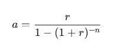

# 5.6 Case study: decarbonization of an island

Αυτή η μελέτη περίπτωσης (case study) αναλύει την πορεία ενός φανταστικού νησιού προς την απανθρακοποίηση, προσφέροντας ένα μοντέλο για τη μετάβαση απομονωμένων ενεργειακών συστημάτων στην αειφορία.

### Το Προφίλ του EcoIsle

> - Τοποθεσία & Πληθυσμός: Βρίσκεται σε εύκρατη κλίμακα και κατοικείται από περίπου 50.000 κατοίκους.
> - Ιστορικό Υπόβαθρο: Το νησί βασιζόταν παραδοσιακά σε εισαγόμενα ορυκτά καύσιμα (κυρίως μονάδες άνθρακα και φυσικού αερίου).
> - Προβλήματα: Η εξάρτηση αυτή οδηγούσε σε πολύ υψηλό ενεργειακό κόστος, μεγάλες εκπομπές διοξειδίου του άνθρακα και οικονομική ευπάθεια λόγω της γεωγραφικής απομόνωσης.

### Η μετάβαση στο νέο μοντέλο ξεκίνησε από την αναγνώριση δύο κρίσιμων παραγόντων:

- Οικονομική Επιβάρυνση: Το παλαιωμένο ενεργειακό μοντέλο αποτελούσε τροχοπέδη για την τοπική οικονομία.
- Περιβαλλοντικοί Κίνδυνοι: Η ανάγκη προστασίας του τοπικού οικοσυστήματος και η παγκόσμια στροφή προς την αειφορία.

#### 1. Οι Κύριες Τεχνολογίες (Οι Δύο Πυλώνες)

- Ηλιακή Ενέργεια: Ταχεία εγκατάσταση φωτοβολταϊκών πάρκων μεγάλης κλίμακας, αλλά και οικιακών συστημάτων σε στέγες. Η επιτυχία βασίστηκε σε ευνοϊκές κυβερνητικές πολιτικές και ενεργή συμμετοχή των πολιτών.
- Αιολική Ενέργεια: Αξιοποίηση της παράκτιας τοποθεσίας με χερσαία αιολικά πάρκα. Ο συνδυασμός ήλιου και ανέμου (συμπληρωματικά προφίλ παραγωγής) μείωσε δραστικά την ανάγκη για εισαγόμενα καύσιμα.

#### 2. Διαφοροποίηση και Μελλοντικές Προοπτικές

Αν και η μελέτη επικεντρώνεται στον ήλιο και τον άνεμο, το EcoIsle διερεύνησε επίσης:

- Μικρής κλίμακας βιομάζα.
- Παλιρροϊκή ενέργεια για την αντιμετώπιση των εποχιακών διακυμάνσεων.
- Η στρατηγική ακολούθησε το πραγματικό μοντέλο μετάβασης: πρώτα υιοθετούνται οι ώριμες τεχνολογίες (ήλιος/άνεμος) και έπονται οι πιο εξειδικευμένες.

#### 3. Στρατηγικά Διδάγματα για την Επιτυχία

Η εμπειρία του EcoIsle ανέδειξε τρεις κρίσιμους παράγοντες:
- Σωστός Σχεδιασμός: Βαθιά κατανόηση των τοπικών πόρων και αναγκών.
- Κοινωνική Συμμετοχή: Η έγκαιρη εμπλοκή της τοπικής κοινωνίας εκμηδένισε τα εμπόδια υλοποίησης και αύξησε την αποδοχή.
- Έξυπνες Τεχνολογίες: Χρήση προηγμένων προγνωστικών μοντέλων, διαχείριση της ζήτησης και συστήματα αποθήκευσης για τη σταθερότητα του δικτύου.


## ΜΟΝΤΕΛΟ ΒΑΣΗΣ (baseline model)

Περιγραφή της Διαδικασίας (7 Βήματα)

1. **Προετοιμασία Δικτύου**: Δημιουργείται το αντικείμενο Network που αποτελεί τον "σκελετό" του συστήματος.
2. **Χρονικό Πλαίσιο**: Ορίζεται ένα 24ωρο (snapshots) με ωριαία ανάλυση για την παρακολούθηση των διακυμάνσεων ζήτησης.
3. **Κεντρικός Δίαυλος (Bus)**: Δημιουργείται ένας κεντρικός κόμβος ("Main Bus") όπου συνδέονται παραγωγοί και καταναλωτές.
4. **Συμβατικές Μονάδες**: Προστίθενται δύο μονάδες:
5. **Άνθρακας**: 200 MW με κόστος 80 $/MWh.
6. **Φυσικό Αέριο**: 150 MW με κόστος 70 $/MWh.
7. **Προφίλ Φορτίου (Load)**: Εισάγεται η ωριαία ζήτηση ηλεκτρικής ενέργειας.
8. **Βελτιστοποίηση (Optimization)**: Το σύστημα επιλύει το πρόβλημα της "οικονομικής κατανομής" (dispatch), δηλαδή επιλέγει τον φθηνότερο συνδυασμό παραγωγής για κάθε ώρα.
9. **Αξιολόγηση Κόστους**: Εξάγεται το συνολικό ημερήσιο λειτουργικό κόστος (OPEX) ως μέτρο σύγκρισης.


``` python
import pypsa
import pandas as pd
import numpy as np

# Βήμα 1: Αρχικοποίηση του δικτύου
network_old = pypsa.Network()

# Βήμα 2: Ορισμός χρονικού πλαισίου (24 ώρες)
snapshots = pd.date_range("2026-01-01 00:00", "2026-01-01 23:00", freq="h")
network_old.set_snapshots(snapshots)

# Βήμα 3: Δημιουργία κεντρικού διαύλου (Bus)
network_old.add("Bus", "Main Bus")

# Βήμα 4: Προσθήκη συμβατικών μονάδων παραγωγής
# Μονάδα Άνθρακα (Coal)
network_old.add("Generator", "Coal Plant",
                bus="Main Bus",
                p_nom=200,          # Ονομαστική ισχύς σε MW
                marginal_cost=80,   # Κόστος ανά MWh
                carrier="coal")

# Μονάδα Φυσικού Αερίου (Gas)
network_old.add("Generator", "Gas Plant",
                bus="Main Bus",
                p_nom=150,          # Ονομαστική ισχύς σε MW
                marginal_cost=70,   # Κόστος ανά MWh (φθηνότερο από άνθρακα)
                carrierr="gas")

# Βήμα 5: Ορισμός προφίλ φορτίου (Ενδεικτική ωριαία ζήτηση)
# Δημιουργούμε μια τυχαία διακύμανση ζήτησης για το παράδειγμα
hourly_load = [ 180, 170, 165, 160, 160, 165, 170, 180, 190, 200,  
                210, 220, 230, 240, 245, 250, 245, 240, 230, 220,
                210, 200, 190, 185]

network_old.add("Load", "Baseline Load", 
                bus="Main Bus", 
                p_set=hourly_load)

# Βήμα 6: Βελτιστοποίηση δικτύου
# Χρησιμοποιεί Linear Optimal Power Flow (LOPF)
network_old.optimize(solver_name='highs') # Απαιτείται solver όπως glpk ή gurobi

# Βήμα 7: Εξαγωγή αποτελεσμάτων
initial_system_cost = network_old.objective
print(f"Initial System Costs: {initial_system_cost}")


# total_cost = network_old.objective
# print(f"Συνολικό Λειτουργικό Κόστος (OPEX): {total_cost:.2f} $")

# # Προαιρετικά: Εμφάνιση παραγωγής ανά μονάδα
# print("\nΠαραγωγή ανά ώρα (MW):")
# print(network_old.generators_t.p)
```

[DECARBONIZATION](decarbonization.ipynb)

## Μετάβαση σε ένα σύστημα ανανεώσιμων πηγών ενέργειας

Περιγραφή της Διαδικασίας (8 Βήματα)

1. **Δημιουργία Νέου Δικτύου**: Ορίζεται το αντικείμενο network_new για την πράσινη μετάβαση.
2. **Χρονικό Πλαίσιο**: Διατηρείται το ίδιο 24ωρο για να είναι εφικτή η σύγκριση με το προηγούμενο σενάριο.
3. **Κεντρικός Δίαυλος**: Παραμένει ο "Main Bus" ως το κέντρο διασύνδεσης.
4. **Προφίλ Διαθεσιμότητας**: Εισάγονται χρονοσειρές (p_max_pu) που δείχνουν πόση ενέργεια μπορούν να παράγουν ο ήλιος και ο άνεμος ανά ώρα (π.χ. ο ήλιος μηδενίζεται τη νύχτα).
5. **Προσθήκη Μονάδων**: 
    - Φυσικό Αέριο: Παραμένει ως εφεδρεία (backup) με υψηλό κόστος.
    - Solar PV: Ορίζεται ως extendable=True. Το PyPSA θα υπολογίσει πόσα MW "συμφέρει" να χτιστούν.
    - Αιολικά: Προστίθενται με σταθερή ισχύ.
6. **Φορτίο**: Χρησιμοποιείται το ίδιο προφίλ ζήτησης για δίκαιη σύγκριση.
7. **Συνολική Βελτιστοποίηση**: Το μοντέλο ελαχιστοποιεί το άθροισμα του CAPEX (κόστος κατασκευής) και του OPEX (κόστος λειτουργίας).
8. **Ανάλυση Αποτελεσμάτων**: Ελέγχεται το συνολικό κόστος και η ιδανική ισχύς των φωτοβολταϊκών (p_nom_opt).

```python

import pypsa
import pandas as pd
import numpy as np

# Βήμα 1: Αρχικοποίηση του δικτύου
network_old = pypsa.Network()

# Βήμα 2: Ορισμός χρονικού πλαισίου (24 ώρες)
snapshots = pd.date_range("2026-01-01 00:00", "2026-01-01 23:00", freq="h")
network_old.set_snapshots(snapshots)

# Βήμα 3: Δημιουργία κεντρικού διαύλου (Bus)
network_old.add("Bus", "Main Bus")

# Βήμα 4: Προσθήκη συμβατικών μονάδων παραγωγής
# Μονάδα Άνθρακα (Coal)
network_old.add("Generator", "Coal Plant",
                bus="Main Bus",
                p_nom=200,          # Ονομαστική ισχύς σε MW
                marginal_cost=80,   # Κόστος ανά MWh
                carrier="coal")

# Μονάδα Φυσικού Αερίου (Gas)
network_old.add("Generator", "Gas Plant",
                bus="Main Bus",
                p_nom=150,          # Ονομαστική ισχύς σε MW
                marginal_cost=70,   # Κόστος ανά MWh (φθηνότερο από άνθρακα)
                carrierr="gas")

# Βήμα 5: Ορισμός προφίλ φορτίου (Ενδεικτική ωριαία ζήτηση)
# Δημιουργούμε μια τυχαία διακύμανση ζήτησης για το παράδειγμα
hourly_load = [ 180, 170, 165, 160, 160, 165, 170, 180, 190, 200,  
                210, 220, 230, 240, 245, 250, 245, 240, 230, 220,
                210, 200, 190, 185]

network_old.add("Load", "Baseline Load", 
                bus="Main Bus", 
                p_set=hourly_load)

# Βήμα 6: Βελτιστοποίηση δικτύου
# Χρησιμοποιεί Linear Optimal Power Flow (LOPF)
network_old.optimize(solver_name='highs') # Απαιτείται solver όπως glpk ή gurobi

# Βήμα 7: Εξαγωγή αποτελεσμάτων
initial_system_cost = network_old.objective
print(f"Initial System Costs: {initial_system_cost}")


# total_cost = network_old.objective
# print(f"Συνολικό Λειτουργικό Κόστος (OPEX): {total_cost:.2f} $")

# # Προαιρετικά: Εμφάνιση παραγωγής ανά μονάδα
# print("\nΠαραγωγή ανά ώρα (MW):")
# print(network_old.generators_t.p)

```
[DECARBONIZATION](decarbonization.ipynb)

## 5.6.6 Economic impact: system cost comparison

### 1. OPEX vs CAPEX: Η Θεμελιώδης Διαφορά

Στο ενεργειακό σχεδιασμό, πρέπει να διακρίνουμε δύο είδη κόστους:
---
> #### - CAPEX (Capital Expenditure): 
> Το κεφάλαιο που απαιτείται "εκ των προτέρων" για την κατασκευή των υποδομών (πάνελ, ανεμογεννήτριες). Στο PyPSA, αυτό ορίζεται με την παράμετρο capital_cost.
---
> #### - OPEX (Operating Expenditure):   
> Το κόστος για την καθημερινή λειτουργία (καύσιμα, συντήρηση). Στο PyPSA, αυτό προκύπτει από το marginal_cost πολλαπλασιαζόμενο με την παραγωγή.
---

### 2. Python Κώδικας: Υπολογισμός και Διαχωρισμός Κόστους

Ο παρακάτω κώδικας δείχνει πώς να εξάγετε το καθαρό OPEX του ανανεώσιμου συστήματος (network_new) και να το συγκρίνετε με το συνολικό κόστος που περιλαμβάνει και την επένδυση.

```python
# Step 01: Compare total system costs
print(f"Old Fossil System Cost (OPEX only): "
      f"{network_old.objective:.2f}")
print(f"New Renewable System Cost (OPEX + CAPEX): "
      f"{network_new.objective:.2f}")

# Step 02: Calculate OPEX-only for the renewable system
renewable_opex = (network_new.generators_t.p * network_new.generators.marginal_cost).sum().sum()
print(f"New Renewable System OPEX only: "
      f"{renewable_opex:.2f}")
```

---
## ACCOUNTING FOR CAPITAL COSTS

tο PyPSA μετατρέπει το τεράστιο αρχικό κόστος μιας επένδυσης (π.χ. αγορά ανεμογεννητριών) 
σε μια ετήσια δόση (annuity), ώστε να μπορεί να συγκριθεί δίκαια με τα καθημερινά λειτουργικά έξοδα (καύσιμα).

### 1. Ο Μαθηματικός Τύπος Ranta (Annuity)

Για να μην επιβαρυνθεί "λογιστικά" η πρώτη ημέρα λειτουργίας με όλο το κόστος κατασκευής, χρησιμοποιείται ο συντελεστής ράντα


<div class="container">
  
</div>

Όπου:

    r: Το επιτόκιο προεξόφλησης (discount rate).

    n: Η διάρκεια ζωής της επένδυσης σε έτη (asset lifetime).

Το Ετησιοποιημένο CAPEX προκύπτει από τον πολλαπλασιασμό του συνολικού κόστους με αυτόν τον συντελεστή:

### Annualized CAPEX=a×Capital Cost

### 2. Πώς λειτουργεί στο PyPSA

Από προεπιλογή, αν δεν ορίσεις κάτι διαφορετικό, το PyPSA υποθέτει διάρκεια ζωής 20 έτη και επιτόκιο 7%.

Για να ενεργοποιηθεί αυτός ο υπολογισμός στο μοντέλο του EcoIsle:
- Ορίζουμε την τιμή στο πεδίο capital_cost.
- Θέτουμε p_nom_extendable=True.

``` python
import numpy as np

# Ορισμός παραμέτρων
discount_rate = 0.05  # 5% επιτόκιο αντί για 7%
lifetime = 25         # 25 χρόνια διάρκεια ζωής αντί για 20

# Χειροκίνητος υπολογισμός του συντελεστή annuity (προαιρετικά για έλεγχο)
annuity_factor = discount_rate / (1 - (1 + discount_rate)**(-lifetime))

# Εφαρμογή στο PyPSA
network_new.add("Generator", "Solar PV",
                bus="Main Bus",
                p_nom_extendable=True,
                # Το capital_cost που εισάγουμε είναι το ΕΤΗΣΙΟΠΟΙΗΜΕΝΟ
                capital_cost=100000 * annuity_factor, 
                marginal_cost=0,
                p_max_pu=solar_profile)

# Εναλλακτικά, μπορούμε να ορίσουμε το παγκόσμιο επιτόκιο του δικτύου
network_new.objective_weighting = 1 # Βάρος αντικειμενικής συνάρτησης
```
#### Γιατί είναι σημαντικό για το EcoIsle;

Χωρίς την ετησιοποίηση, το μοντέλο θα έβλεπε το κόστος των φωτοβολταϊκών ως ένα τεράστιο "βουνό" χρημάτων 
που πρέπει να πληρωθεί την πρώτη μέρα, και θα κατέληγε στο συμπέρασμα ότι δεν συμφέρει η επένδυση. 
Με τη χρήση της ράντας, το κόστος κατανέμεται σε βάθος 20ετίας, αποδεικνύοντας ότι η σταδιακή απόσβεση 
μέσω του μηδενικού κόστους καυσίμων είναι η βέλτιστη οικονομική λύση.
---

## 5.6.7. ΠΕΡΙΒΑΛΛΟΝΤΙΚΟ ΑΠΟΤΎΠΩΜΑ

### 1. Η Διαδικασία Υπολογισμού Ρύπων

Για να μετρήσουμε την περιβαλλοντική επίδραση, ακολουθούμε μια συστηματική προσέγγιση τεσσάρων βημάτων:
- **Ορισμός Συντελεστών Εκπομπών**: Καθορίζουμε πόσοι τόνοι CO2​ παράγονται ανά παραγόμενη MWh.

      - **Άνθρακας**: 0.9 τόνοι/MWh (ο πιο ρυπογόνος).
      - **Φυσικό Αέριο**: 0.4 τόνοι/MWh.
      - **ΑΠΕ (Ήλιος/Άνεμος)**: 0 τόνοι/MWh.
- **Ανάθεση στο Μοντέλο**: Εισάγουμε αυτούς τους συντελεστές απευθείας στα DataFrames των γεννητριών του PyPSA.
- **Υπολογισμός**: Πολλαπλασιάζουμε την ωριαία παραγωγή κάθε μονάδας με τον συντελεστή της και αθροίζουμε για όλο το 24ωρο.
```python
# Step 01: Define emission factors
# (example values in tons of CO2 per MWh)
emission_factors = {
    "Coal Plant": 0.9,    # High emissions for coal
    "Gas Plant": 0.4,     # Moderate emissions for gas
    "Solar PV": 0,        # Zero emissions for solar
    "Onshore Wind": 0     # Zero emissions for wind
}

# Step 02: Assign emission factors to generators
for gen_name, ef in emission_factors.items():
    if gen_name in network_old.generators.index:
        network_old.generators.loc[gen_name, 
                                 'emission_factor'] = ef
    if gen_name in network_new.generators.index:
        network_new.generators.loc[gen_name, 
                                 'emission_factor'] = ef

# Step 03: Define function to calculate total emissions
def calculate_total_emissions(network):
    emissions = 0
    for gen_name, gen_data in network.generators.iterrows():
        generation = network.generators_t.p[gen_name]
        emission_factor = gen_data['emission_factor']
        gen_emissions = sum(generation * emission_factor)
        emissions += gen_emissions
    return emissions

# Step 04: Calculate emissions for both systems
old_emissions = calculate_total_emissions(network_old)
new_emissions = calculate_total_emissions(network_new)

# Step 05: Output emissions results
print(f"Old System Emissions: {old_emissions} tons CO2")
print(f"New System Emissions: {new_emissions} tons CO2")

```

[DECARBONIZATION](decarbonization.ipynb)

### 3. Ερμηνεία Αποτελεσμάτων

Τα αποτελέσματα της μελέτης είναι εντυπωσιακά:
- **Fossil System**: ~2.569,5 τόνοι CO2​.
- **Renewable System**: ~590,0 τόνοι CO2​.
- **Αποτέλεσμα**: Μείωση 75% στις εκπομπές αερίων του θερμοκηπίου.

Συμπέρασμα Μελέτης

Η περίπτωση του EcoIsle αποδεικνύει ότι η χρήση του PyPSA επιτρέπει στους σχεδιαστές να εξισορροπούν την οικονομική αποδοτικότητα (ελάχιστο κόστος) με την περιβαλλοντική βιωσιμότητα (ελάχιστοι ρύποι). Το 75% λιγότερο CO2​ δεν είναι απλά ένας αριθμός, αλλά η απόδειξη ότι η τεχνολογική στροφή προς τις ΑΠΕ είναι ο μόνος δρόμος για την επίτευξη των παγκόσμιων κλιματικών στόχων.

Πώς σου φαίνεται αυτή η μείωση; Αν σκεφτείς ότι το κόστος αυξήθηκε ελάχιστα (λόγω CAPEX) αλλά οι ρύποι μειώθηκαν κατά 75%, θεωρείς ότι η επένδυση "βγάζει τα λεφτά της" από περιβαλλοντική σκοπιά;
---

### 1. Συντελεστής Εκπομπών (Emission Factor)

Ορίζει την περιβαλλοντική "τιμή" κάθε παραγόμενης μονάδας ενέργειας.
- Μονάδα Μέτρησης: Συνήθως tCO2​/MWh (τόνοι διοξειδίου του άνθρακα ανά μεγαβατώρα).
- Λειτουργία: Ποσοτικοποιεί πόσο CO2​ απελευθερώνεται κατά την καύση.
- Στο Μοντέλο: * Οι ρυπογόνες μονάδες (άνθρακας, αέριο) έχουν θετικούς συντελεστές.
      Οι ΑΠΕ (ήλιος, άνεμος) έχουν μηδενικό συντελεστή (carbon-neutral), καθώς δεν εκπέμπουν ρύπους κατά την παραγωγή.

### 2. Συντελεστής Ισχύος (Capacity Factor)

Ορίζει την επιχειρησιακή "απόδοση" μιας μονάδας σε σχέση με τη μέγιστη θεωρητική της ικανότητα.
- Ορισμός: Είναι ο λόγος της πραγματικής ενέργειας που παρήχθη προς τη μέγιστη δυνατή ενέργεια που θα μπορούσε να παραχθεί αν η μονάδα δούλευε στο 100% συνέχεια.
- Μεταβλητότητα: Εξαρτάται από τη φύση της τεχνολογίας και τους φυσικούς πόρους (π.χ. πόσο φυσάει ή πόσο ήλιο έχει).
- Στο PyPSA: Υλοποιείται μέσω της παραμέτρου p_max_pu. Για παράδειγμα, αν ένα φωτοβολταϊκό έχει p_max_pu = 0.5, σημαίνει ότι εκείνη τη στιγμή αποδίδει το 50% της ονομαστικής του ισχύος.

### Γιατί είναι σημαντικά αυτά τα μεγέθη;

Αυτές οι δύο παράμετροι επηρεάζουν άμεσα τα αποτελέσματα της βελτιστοποίησης:
- **Dispatch Dynamics**: Το μοντέλο θα "τιμωρήσει" μονάδες με υψηλούς ρύπους αν υπάρχουν περιορισμοί (π.χ. φόρος άνθρακα).
- **System Costs**: Ο χαμηλός Capacity Factor των ΑΠΕ σημαίνει ότι χρειαζόμαστε μεγαλύτερη εγκατεστημένη ισχύ (περισσότερα πάνελ) για να καλύψουμε την ίδια ζήτηση.
- **Investment Decisions**: Ο συνδυασμός χαμηλών ρύπων και δωρεάν καυσίμου κάνει τις ΑΠΕ ελκυστικές, παρά τη στοχαστικότητά τους (χαμηλό Capacity Factor τη νύχτα ή σε απνοια).

Συνοπτικά: Ο Emission Factor μετρά την καθαρότητα, ενώ ο Capacity Factor μετρά τη διαθεσιμότητα. Μαζί, καθορίζουν τη βιωσιμότητα και την αξιοπιστία του ενεργειακού μας συστήματος.
---

[DECARBONIZATION II](decarbonization2_wind.ipynb)


