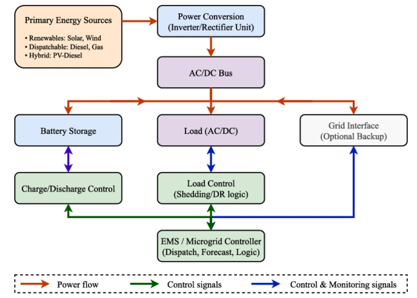
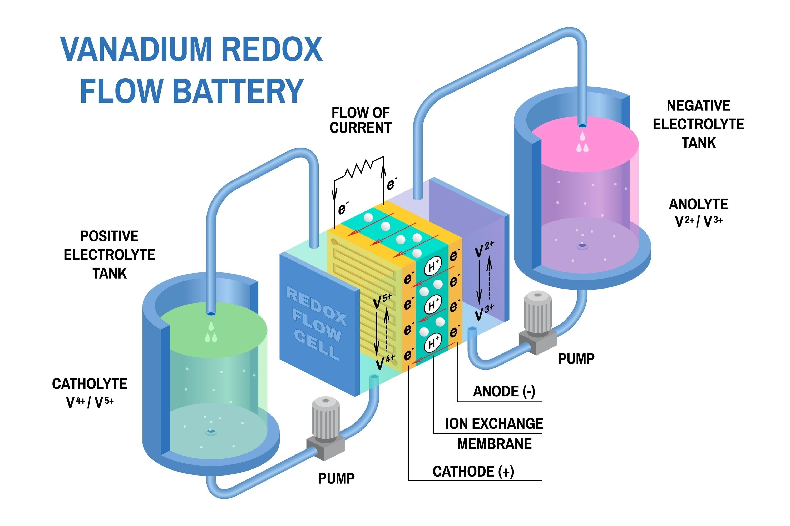

#### Chapter 6: 
# **Microgrids and distributed energy resources**

### 6.1 Εισαγωγή στα μικροδίκτυα

 1). Τα μικροδίκτυα ορίζονται ως αυτόνομα ενεργειακά συστήματα που ενσωματώνουν διεσπαρμένους ενεργειακούς πόρους (DERs) και τοπικά φορτία μέσα σε ένα περιορισμένο δίκτυο.

2). Λειτουργούν ως ενιαίες ελεγχόμενες οντότητες και μπορούν να εργάζονται είτε σε σύνδεση με το κεντρικό δίκτυο είτε αυτόνομα (σε κατάσταση "νησίδας") κατά τη διάρκεια διαταραχών.

3). Τα βασικά συστατικά τους περιλαμβάνουν μονάδες παραγωγής, συστήματα αποθήκευσης, ελεγχόμενα φορτία και μια έξυπνη αρχιτεκτονική ελέγχου (EMS) για τη διαχείριση της ροής ενέργειας.

#### Σύνοψη Λειτουργίας Μικροδικτύου

Το διάγραμμα περιγράφει ένα ολοκληρωμένο σύστημα που διαχειρίζεται την παραγωγή, τη μετατροπή, την αποθήκευση και την κατανάλωση ενέργειας μέσω ενός κεντρικού "εγκεφάλου".

  

#### 1. Παραγωγή και Μετατροπή (Power Generation & Conversion)
> #### Η ροή ξεκινά από τις Πρωτογενείς Πηγές Ενέργειας, οι οποίες χωρίζονται σε τρεις κατηγορίες:
>- Ανανεώσιμες: Ήλιος και άνεμος.
>- Ελεγχόμενες (Dispatchable): Γεννήτριες ντίζελ και αερίου (που παρέχουν ευστάθεια).
>- Υβριδικές: Συνδυασμοί όπως Φωτοβολταϊκά-Ντίζελ.
>- Η ενέργεια αυτή περνά από μονάδες Μετατροπής Ισχύος (Inverters/Rectifiers) για να προσαρμοστεί στις προδιαγραφές του κεντρικού διαύλου (Bus).
---
#### 2. Διανομή και Αποθήκευση (Distribution & Storage)
> #### Όλη η ισχύς συγκεντρώνεται στον AC/DC Δίαυλο (Bus), ο οποίος λειτουργεί ως ο κεντρικός κόμβος διανομής προς:
>- Σύστημα Μπαταριών: Για αποθήκευση ενέργειας.
>- Φορτία (Load): Τους τελικούς καταναλωτές.
>- Διασύνδεση Δικτύου (Grid Interface): Προαιρετική σύνδεση με το κεντρικό ηλεκτρικό δίκτυο για εφεδρεία.
---
#### 3. Έλεγχος και Διαχείριση (Control & EMS)
> #### Aυτό είναι το πιο κρίσιμο κομμάτι του διαγράμματος, όπου το EMS (Energy Management System) ή ο Ελεγκτής Μικροδικτύου συντονίζει τα πάντα μέσω σημάτων ελέγχου:
>- Διαχείριση Μπαταρίας: Ελέγχει τη φόρτιση και εκφόρτιση ανάλογα με τις ανάγκες.
>- Διαχείριση Φορτίου: Εφαρμόζει λογική "απόρριψης φορτίου" (Load Shedding) ή "απόκρισης ζήτησης" (Demand Response - DR) για να διατηρήσει την ισορροπία όταν η παραγωγή είναι χαμηλή.
>- Πρόβλεψη και Λογική: Ο ελεγκτής χρησιμοποιεί προβλέψεις (Forecasts) για τον καιρό και τη ζήτηση ώστε να αποφασίσει την πιο οικονομική και ασφαλή λειτουργία (Dispatch).

#### Συμπέρασμα
> ##### Το σύστημα αυτό δεν είναι μια απλή γραμμή παραγωγής, αλλά ένα κλειστό κύκλωμα ελέγχου. Ο ελεγκτής (EMS) διασφαλίζει ότι, είτε φυσάει είτε όχι, οι καταναλωτές θα έχουν ρεύμα, χρησιμοποιώντας έξυπνα τις μπαταρίες, τις γεννήτριες και, αν χρειαστεί, μειώνοντας αυτόματα τη μη κρίσιμη κατανάλωση.

---

#### 6.1.1 Τι είναι η Απόκριση Ζήτησης (DR);

> #### Είναι η διαδικασία κατά την οποία οι καταναλωτές μεταβάλλουν τη χρήση ηλεκτρικής ενέργειας ως απάντηση σε:
>- Μεταβαλλόμενες συνθήκες προσφοράς: Π.χ. απότομη πτώση του ανέμου.
>- Σήματα τιμών: Υψηλές τιμές τις ώρες αιχμής.
>- Απαιτήσεις δικτύου: Ανάγκη για αποφυγή υπερφόρτωσης των γραμμών.

#### Γιατί είναι κρίσιμη στα Μικροδίκτυα;
>- Σε ένα μικροδίκτυο (όπως το EcoIsle), η Απόκριση Ζήτησης επιτρέπει στον ελεγκτή να "χαμηλώνει" τα φορτία όταν οι ΑΠΕ είναι περιορισμένες ή οι μπαταρίες έχουν εξαντληθεί. 
>- Αυτό είναι ζωτικής σημασίας όταν το μικροδίκτυο λειτουργεί σε νησιωτική κατάσταση (islanded mode), δηλαδή αποκομμένο από το κεντρικό δίκτυο, όπου κάθε κιλοβατώρα μετράει.

> #### Απλά Παραδείγματα Εφαρμογής
>- Καθυστέρηση Φόρτισης Ηλεκτρικών Οχημάτων (EV): Μεταφορά της φόρτισης τις ώρες που υπάρχει πλεόνασμα ηλιακής ενέργειας.
>- Προσωρινή Απενεργοποίηση Κλιματισμού: Μικρές παύσεις στη λειτουργία κατά τη διάρκεια της αιχμής που δεν επηρεάζουν σημαντικά τη θερμοκρασία του χώρου.
>- Προγραμματισμός Συσκευών: Λειτουργία θερμοσιφώνων ή πλυντηρίων σε ώρες εκτός αιχμής (off-peak).

Η Σημασία της Μετάβασης

Η Απόκριση Ζήτησης μετατρέπει τους καταναλωτές από παθητικούς δέκτες σε ενεργούς συμμετέχοντες. Αντί το δίκτυο να "παλεύει" μόνο του να βρει ενέργεια, το σπίτι ή η επιχείρηση βοηθάει το σύστημα να παραμείνει ευέλικτο και ανθεκτικό.

    Συμπέρασμα: Στο PyPSA, το DR μοντελοποιείται συχνά επιτρέποντας στο φορτίο (Load) να είναι ελαστικό ή χρησιμοποιώντας "αποθήκευση" που προσομοιώνει τη μετατόπιση της κατανάλωσης. Είναι ένα από τα πιο ισχυρά εργαλεία για τη μείωση του συνολικού κόστους του συστήματος.

---

#### 6.1.2 Το EMS (Energy Management System - Σύστημα Διαχείρισης Ενέργειας) 
>- είναι ο «εγκέφαλος» ενός έξυπνου δικτύου ή ενός μικροδικτύου. Η δουλειά του είναι να λαμβάνει συνεχώς δεδομένα και να παίρνει αποφάσεις σε πραγματικό χρόνο για να εξισορροπεί την προσφορά και τη ζήτηση με το χαμηλότερο δυνατό κόστος.

Ακολουθεί η ανάλυση του τρόπου λειτουργίας του σε 4 βασικά στάδια:

> 1. **Συλλογή Δεδομένων και Παρακολούθηση (Monitoring)**
Το EMS συνδέεται μέσω αισθητήρων και έξυπνων μετρητών (Smart Meters) με όλα τα στοιχεία του συστήματος.
Τι παρακολουθεί: Την τρέχουσα παραγωγή των ΑΠΕ (πάνελ, ανεμογεννήτριες), το επίπεδο φόρτισης των μπαταριών (SOC) και τη ζήτηση των καταναλωτών.
Εξωτερικά δεδομένα: Λαμβάνει προγνώσεις καιρού (για να ξέρει πόσο ήλιο/αέρα θα έχει) και τιμές ηλεκτρικής ενέργειας από την αγορά.

> 2. **Πρόβλεψη και Σχεδιασμός (Forecasting & Optimization)**
Αυτή είναι η πιο «έξυπνη» λειτουργία. Το EMS χρησιμοποιεί αλγορίθμους για να προβλέψει τι θα συμβεί τις επόμενες ώρες.
Παράδειγμα: Αν προβλέψει ότι σε 3 ώρες θα κοπεί ο άνεμος αλλά η ζήτηση θα ανέβει, αποφασίζει από τώρα να κρατήσει ενέργεια στην μπαταρία ή να προθερμάνει το νερό μέσω Demand Response.
Στόχος: Ελαχιστοποίηση του κόστους (π.χ. αποφυγή λειτουργίας της ακριβής γεννήτριας ντίζελ).

> 3. **Λήψη Αποφάσεων και Έλεγχος (Control Logic)**
Το EMS στέλνει σήματα ελέγχου (Control Signals) στα διάφορα components:
Στις Μπαταρίες: «Φόρτισε τώρα γιατί έχουμε περίσσεια ήλιου» ή «Εκφόρτισε τώρα γιατί η τιμή του ρεύματος είναι πολύ υψηλή».
Στα Φορτία (Demand Response): «Κλείσε προσωρινά τους θερμοσίφωνες/κλιματιστικά» (Load Shedding) για να μην καταρρεύσει το σύστημα.
Στις Γεννήτριες: «Ξεκίνα τη μονάδα αερίου γιατί η μπαταρία αδειάζει».

> 4. **Εξισορρόπηση σε Πραγματικό Χρόνο (Balancing)**
Επειδή η παραγωγή από ΑΠΕ μπορεί να αλλάξει σε δευτερόλεπτα (π.χ. ένα σύννεφο πάνω από τα φωτοβολταϊκά), το EMS κάνει μικρο-ρυθμίσεις συνεχώς:
Πλεόνασμα ενέργειας: Κατευθύνεται στην μπαταρία ή σε θερμικά φορτία (Power-to-Heat).
Έλλειμμα ενέργειας: Ενεργοποιεί την αποθήκευση ή ζητά από τους καταναλωτές να μειώσουν το φορτίο τους.

> **Συνοπτικά: Πώς το βλέπουμε στο PyPSA;**
- **Στο PyPSA, το EMS είναι ουσιαστικά ο Solver (ο επιλυτής). Όταν τρέχεις την εντολή n.optimize(), το πρόγραμμα κάνει ακριβώς τη δουλειά του EMS:**
- **Εξετάζει όλους τους περιορισμούς (π.χ. χωρητικότητα μπαταρίας).**
- **Εξετάζει τα προφίλ καιρού και φορτίου.**
- **Βρίσκει την ιδανική κατανομή (dispatch) ώστε να καλύψει το φορτίο με το ελάχιστο κόστος.**

Το EMS μετατρέπει ένα σύνολο από καλώδια και γεννήτριες σε ένα «ζωντανό» και έξυπνο σύστημα που μπορεί να αυτο-ρυθμίζεται.**

---

### 6.2 Οφέλη των μικροδικτύων

Προσφέρουν αυξημένη αξιοπιστία και ανθεκτικότητα στις τοπικές κοινότητες, επιτρέποντας την απρόσκοπτη μετάβαση σε αυτόνομη λειτουργία.

Συμβάλλουν στην ενεργειακή ανεξαρτησία και στη μείωση του λειτουργικού κόστους μέσω της τοπικής παραγωγής.

Διευκολύνουν την ενσωμάτωση ανανεώσιμων πηγών ενέργειας και μειώνουν τις απώλειες μεταφοράς.

---

### 6.3 Προκλήσεις στην εφαρμογή μικροδικτύων

Υπάρχουν σημαντικά εμπόδια, όπως το υψηλό αρχικό κεφαλαιακό κόστος και οι ρυθμιστικές αβεβαιότητες.

Η λειτουργική πολυπλοκότητα, ειδικά στη διαχείριση μεταβλητών πηγών και στη διασφάλιση της ευστάθειας του δικτύου, παραμένει κρίσιμο ζήτημα.

---

### 6.4 Μελέτη περίπτωσης: Αγροτικός εξηλεκτρισμός με μικροδίκτυα

Η μελέτη χρησιμοποιεί το PyPSA για τη μοντελοποίηση ενός αγροτικού μικροδικτύου με βάση πραγματικά δεδομένα χρονοσειρών (OPSD) από τη Βουλγαρία.

Εξετάζονται σενάρια ενσωμάτωσης ηλιακής και αιολικής ενέργειας, καθώς και στρατηγικές απόκρισης ζήτησης (Demand Response).

Η χρήση ευέλικτης ζήτησης και αποθήκευσης αποδεικνύεται ότι μειώνει δραστικά τις εκπομπές ρύπων και το λειτουργικό κόστος, ενισχύοντας ταυτόχρονα την αξιοπιστία σε απομακρυσμένες περιοχές.

## Στόχοι

#### 1. Προσομοίωση Αγροτικού Μικροδικτύου
> - Το πρώτο βήμα είναι η κατασκευή του μοντέλου. Χρησιμοποιούνται Ανανεώσιμες Πηγές Ενέργειας (ΑΠΕ), κυρίως φωτοβολταϊκά και ανεμογεννήτριες, με στόχο την κάλυψη της τοπικής ζήτησης.
> - Στόχος: Η μείωση της εξάρτησης από το κεντρικό δίκτυο ή από ρυπογόνες συμβατικές γεννήτριες (π.χ. ντίζελ).

#### 2. Αξιολόγηση Ευελιξίας Ζήτησης (Demand Response)
> - Εξετάζονται στρατηγικές Απόκρισης Ζήτησης σε δύο επίπεδα. Η λογική είναι η μετατόπιση των φορτίων (load shifting) ώστε να συμπίπτουν με τις ώρες που υπάρχει μεγάλη παραγωγή από τον ήλιο ή τον άνεμο.
> - Στόχος: Η καλύτερη ευθυγράμμιση παραγωγής και κατανάλωσης χωρίς να απαιτούνται τεράστιες μπαταρίες.

#### 3. Βελτιστοποίηση μέσω PyPSA
> - Εφαρμόζεται το υπολογιστικό πλαίσιο του PyPSA για την ελαχιστοποίηση του λειτουργικού κόστους και των εκπομπών ρύπων.
> - Λειτουργία: Το μοντέλο αποφασίζει πότε θα λειτουργήσει η αποθήκευση (μπαταρίες), πότε θα γίνει χρήση των ΑΠΕ και πώς θα κατανεμηθούν οι πόροι με τον πιο οικονομικά αποδοτικό τρόπο.

#### 4. Συγκρίσεις Σεναρίων
> - Τέλος, πραγματοποιείται σύγκριση διαφορετικών σεναρίων για να εξαχθούν συμπεράσματα σχετικά με:
> - Τη διείσδυση των ΑΠΕ: Τι συμβαίνει αν αυξήσουμε τα πάνελ;
> - Την ευελιξία της ζήτησης: Πόσο μειώνεται το κόστος αν οι καταναλωτές είναι συνεργάσιμοι;
> - Δείκτες Απόδοσης (KPIs): Τελικό κόστος, συνολικές εκπομπές CO2​ και ποσοστό αξιοποίησης της πράσινης ενέργειας.

### Συμπέρασμα: Η μελέτη (όπως περιγράφεται στη σελίδα 137) αποδεικνύει ότι ο συνδυασμός έξυπνης βελτιστοποίησης και ευέλικτης κατανάλωσης είναι η πιο βιώσιμη λύση για την παροχή ηλεκτρικού ρεύματος σε απομακρυσμένες περιοχές.

---
### 1. Φυσικοί Πόροι και Περιβάλλον
- Η περιοχή επιλέχθηκε λόγω των ευνοϊκών καιρικών συνθηκών: σταθερή ηλιοφάνεια και αξιόπιστα αιολικά πρότυπα. Αυτά τα χαρακτηριστικά καθιστούν την τοποθεσία ιδανική για την ενσωμάτωση φωτοβολταϊκών (PV) και ανεμογεννητριών, οι οποίες αποτελούν τις κύριες πηγές παραγωγής του συστήματος.
### 2. Προφίλ Κατανάλωσης (Load Profile)
Το μικροδίκτυο εξυπηρετεί μια κοινότητα μικτής χρήσης:
- Οικιακοί καταναλωτές (σπίτια).
- Εμπορικοί καταναλωτές (καταστήματα).
- Μικρές βιομηχανίες.
- Όλοι αυτοί οι καταναλωτές συγκεντρώνονται σε ένα ενιαίο «προφίλ φορτίου» που αντικατοπτρίζει τις πραγματικές ημερήσιες και εποχιακές διακυμάνσεις της ζήτησης.

### 3. Υποδομή και Αποθήκευση
- Για την αντιμετώπιση της στοχαστικότητας των ΑΠΕ (όταν δεν φυσάει ή έχει συννεφιά), το σύστημα περιλαμβάνει:
- Μπαταρία Ροής (Flow Battery): Ισχύος 100 MW και χωρητικότητας 600 MWh.
- Λειτουργία: Αποθηκεύει το πλεόνασμα ενέργειας και το αποδίδει κατά τις ώρες αιχμής ή χαμηλής παραγωγής.

  

### 4. Έξυπνη Διαχείριση και Demand Response
Η διαχείριση γίνεται μέσω ενός ψηφιακού επιπέδου EMS (Energy Management System).
- Demand Response (DR): Ένας δυναμικός μηχανισμός προσαρμόζει την κατανάλωση σε πραγματικό χρόνο.
- Στρατηγικές: Εξετάζονται δύο επίπεδα παρέμβασης (συντηρητικό και επιθετικό) για τη μετατόπιση των φορτίων.

### 5. Τρόποι Λειτουργίας (Dual-Mode)
Το μικροδίκτυο έχει τη δυνατότητα να λειτουργεί με δύο τρόπους:
- Grid-connected: Συνδεδεμένο με το κεντρικό δίκτυο για εισαγωγή/εξαγωγή ενέργειας.
- Islanded (Νησιωτική λειτουργία): Πλήρως αυτόνομο, βασιζόμενο αποκλειστικά στους δικούς του πόρους.

### 6. Μοντελοποίηση με PyPSA
- Ολόκληρο το σύστημα (μονάδες παραγωγής, μπαταρίες, στρατηγικές ελέγχου) έχει μοντελοποιηθεί στο PyPSA. Αυτό επιτρέπει την αξιολόγηση της απόδοσης σε τρεις άξονες: τεχνικό, οικονομικό και περιβαλλοντικό (μείωση ρύπων).

### Συμπέρασμα: Πρόκειται για ένα εξελιγμένο μοντέλο που αποδεικνύει πώς οι τεχνολογίες αποθήκευσης και ο έξυπνος έλεγχος της ζήτησης μπορούν να καταστήσουν μια απομακρυσμένη κοινότητα ενεργειακά ανεξάρτητη και βιώσιμη.

## ΜΟΝΤΕΛΟ

[microgrids](microgrids.ipynb)

### 1. Βασική περίπτωση (Ντίζελ + Δίκτυο)
- #### Ανάλυση αποτελεσμάτων: Σε αυτό το σενάριο, το μικροδίκτυο βασίζεται σε μια γεννήτρια ντίζελ (3 MW) ως κύρια πηγή, με το κεντρικό δίκτυο να λειτουργεί ως εφεδρεία. Η γεννήτρια ντίζελ χρησιμοποιείται μέχρι το ονομαστικό της όριο, ενώ το δίκτυο καλύπτει τις αιχμές της ζήτησης. Αυτή η διαμόρφωση έχει το υψηλότερο λειτουργικό κόστος και τις μεγαλύτερες εκπομπές CO2 λόγω της πλήρους εξάρτησης από ορυκτά καύσιμα.

Ανάλυση γραφημάτων:
- Εικόνα 6.3: Δείχνει τη συνεχή λειτουργία της γεννήτριας ντίζελ (περίπου 3000 MW σταθερά) και τη μεταβλητή παροχή από το δίκτυο που ακολουθεί τις καθημερινές διακυμάνσεις της ζήτησης.
- Εικόνα 6.8 & 6.9: Το κόστος υπερβαίνει τα 70 εκατομμύρια δολάρια και οι εκπομπές αγγίζουν τους 365.000 τόνους, αποτελώντας το σημείο αναφοράς για τα υπόλοιπα σενάρια.

### 2. Ενσωμάτωση Ανανεώσιμων Πηγών (Solar + Wind)
#### Ανάλυση αποτελεσμάτων: Η προσθήκη φωτοβολταϊκών και ανεμογεννητριών μειώνει δραστικά την ανάγκη για ντίζελ και εισαγωγές από το δίκτυο. Ο ήλιος κυριαρχεί τις μεσημεριανές ώρες, ενώ ο άνεμος παρέχει πιο συνεχή υποστήριξη. Αυτή η διαφοροποίηση βελτιώνει την αυτονομία του μικροδικτύου και μειώνει τις εκπομπές ρύπων.
  
  Ανάλυση γραφημάτων:
  - Εικόνα 6.4: Απεικονίζει το μείγμα παραγωγής όπου οι ΑΠΕ καλύπτουν σημαντικό μέρος του φορτίου, μειώνοντας το "πάνω" μέρος της στοίβας (δίκτυο) σε σύγκριση με τη βασική περίπτωση.
  - Εικόνα 6.8: Το λειτουργικό κόστος πέφτει αισθητά στα περίπου 54 εκατομμύρια δολάρια.

### 3. Απόκριση Ζήτησης (Demand Response - DR)
#### Οι στρατηγικές DR μετατοπίζουν το φορτίο ώστε να ευθυγραμμίζεται με την διαθεσιμότητα των ΑΠΕ.

- Συντηρητική (Conservative) DR:
  - Αποτελέσματα: Εφαρμόζει ήπιες μεταβολές στη ζήτηση (+/- 10%) κατά τις περιόδους υψηλής/χαμηλής παραγωγής ΑΠΕ. Αυτό προσφέρει μέτρια κέρδη στην αξιοποίηση της καθαρής ενέργειας με ελάχιστη ενόχληση στους χρήστες.
  - Γραφήματα (Εικ. 6.2 & 6.5): Το προφίλ φορτίου μεταβάλλεται ελαφρώς, μειώνοντας λίγο περισσότερο τη χρήση ντίζελ σε σχέση με την απλή ενσωμάτωση ΑΠΕ. Το κόστος μειώνεται στα ~49 εκατομμύρια δολάρια.
    
- Επιθετική (Aggressive) DR:
  - Αποτελέσματα: Επιβάλλει ισχυρότερες μετατοπίσεις φορτίου (+/- 20%) για μέγιστη ευθυγράμμιση με τις αιχμές των ΑΠΕ. Επιτυγχάνει τη μέγιστη αξιοποίηση ηλιακής και αιολικής ενέργειας, ελαχιστοποιώντας σχεδόν πλήρως τις εισαγωγές από το δίκτυο.
  - Γραφήματα (Εικ. 6.6, 6.8, 6.9): Η Εικόνα 6.6 δείχνει τη μέγιστη εκτόπιση των ορυκτών πηγών. Το κόστος πέφτει στο χαμηλότερο επίπεδο (~45 εκατομμύρια δολάρια) και οι εκπομπές μειώνονται στους 275.000 τόνους.

### Συνολική Ανάλυση KPI (Βασικοί Δείκτες Απόδοσης)
#### Αξιοποίηση Ανανεώσιμης Ενέργειας (Εικ. 6.7): Ο ρυθμός απορρόφησης ΑΠΕ αυξάνεται σταδιακά από τη βασική περίπτωση (~0.086) προς την Επιθετική DR (~0.096), αποδεικνύοντας ότι η ευελιξία στη ζήτηση βοηθά στην καλύτερη ενσωμάτωση των καθαρών πηγών.
#### Οικονομικό & Περιβαλλοντικό Όφελος: Η μετάβαση από το "Ντίζελ + Δίκτυο" στην "Επιθετική DR" προσφέρει μια συνεχή πτωτική τάση τόσο στο κόστος όσο και στις εκπομπές CO2, αναδεικνύοντας τον συνδυασμό ΑΠΕ και διαχείρισης φορτίου ως την πιο βιώσιμη λύση.
---

