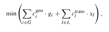

#### Chapter 7: 
# **Transmission planning and expansion**

> - **Tομεακή Σύζευξη (Sector Coupling)**: Αναλύεται η διασύνδεση του τομέα της ηλεκτρικής ενέργειας με άλλους ενεργειακούς τομείς, όπως η θέρμανση, οι μεταφορές και η βιομηχανία.  

> - **Μοντελοποίηση Ζήτησης**: Εξετάζονται οι μέθοδοι ενσωμάτωσης της ζήτησης **θερμότητας και των αναγκών των ηλεκτρικών οχημάτων στο σύστημα PyPSA.  

> - **Τεχνολογίες Αποθήκευσης και Μετατροπής**: Γίνεται αναφορά σε τεχνολογίες όπως οι αντλίες θερμότητας, οι ηλεκτρικοί λέβητες και η παραγωγή υδρογόνου (Power-to-Gas), οι οποίες επιτρέπουν τη μεταφορά ενέργειας μεταξύ διαφορετικών φορέων.  

> - **Βελτιστοποίηση Συστήματος**: Το κεφάλαιο περιγράφει πώς το PyPSA επιλύει προβλήματα βελτιστοποίησης για τον εντοπισμό του χαμηλότερου κόστους σε ένα πλήρως διασυνδεδεμένο ενεργειακό σύστημα, λαμβάνοντας υπόψη τους περιορισμούς εκπομπών CO2.

Το κείμενο αναλύει τον κρίσιμο και μεταβαλλόμενο ρόλο των υποδομών μεταφοράς ηλεκτρικής ενέργειας στα σύγχρονα ενεργειακά συστήματα. Τα βασικά σημεία είναι τα εξής:
- Αλλαγή Παραδείγματος: Η ανάπτυξη του δικτύου μεταφοράς δεν καθοδηγείται πλέον από την απλή αύξηση της ζήτησης, αλλά από την ανάγκη μαζικής ενσωμάτωσης των Ανανεώσιμων Πηγών Ενέργειας (ΑΠΕ) και την επίτευξη βαθιάς απαλλαγής από τον άνθρακα (decarbonization).
- Γεωγραφική Αναντιστοιχία: Επειδή οι ΑΠΕ (όπως η αιολική και η ηλιακή) εξαρτώνται από τις εκάστοτε τοπικές καιρικές συνθήκες, συχνά παράγονται μακριά από τα κέντρα κατανάλωσης. Το δίκτυο μεταφοράς γεφυρώνει αυτό το χάσμα, λειτουργώντας ως βασικό εργαλείο ευελιξίας και ενοποίησης του συστήματος.
- Προκλήσεις Σχεδιασμού: Επειδή τα έργα μεταφοράς είναι δαπανηρά και μακροχρόνια, ο σχεδιασμός τους αντιμετωπίζει μεγάλες αβεβαιότητες (π.χ. ως προς το κόστος τεχνολογιών και τις κλιματικές επιπτώσεις). Αυτό απαιτεί σύγχρονα, δυναμικά μοντέλα αντί για τα παραδοσιακά στατικά.
- Συμφόρηση και Περικοπές (Curtailment): Η έλλειψη επαρκούς χωρητικότητας στο δίκτυο προκαλεί «συμφόρηση», με αποτέλεσμα να πηγαίνει χαμένη η καθαρή ενέργεια (περικοπές) και να αυξάνεται το κόστος. Η επέκταση του δικτύου λύνει αυτά τα προβλήματα.

#### Στόχος του Κεφαλαίου: Το κεφάλαιο εστιάζει στις αρχές του μακροπρόθεσμου σχεδιασμού επέκτασης δικτύων, χρησιμοποιώντας το ανοιχτού κώδικα εργαλείο PyPSA για τη μοντελοποίηση τέτοιων προκλήσεων μέσω μιας ενδεικτικής μελέτης περίπτωσης.

---

### Aξιοπιστία και Ασφάλεια Εφοδιασμού (Reliability and supply security)
- **Θεμελιώδης Στόχος η Αξιοπιστία**: Η απρόσκοπτη παροχή ηλεκτρικής ενέργειας είναι βασικός στόχος του σχεδιασμού. Το σύστημα πρέπει να λειτουργεί ομαλά όχι μόνο υπό κανονικές συνθήκες, αλλά και σε περιπτώσεις βλαβών (π.χ. απώλεια γραμμής ή εξοπλισμού), με το δίκτυο μεταφοράς να παρέχει την απαραίτητη εφεδρεία και ευελιξία.

- **Ασφάλεια Μεταφοράς και Κριτήριο "N-1"**: Η επάρκεια στην παραγωγή δεν αρκεί· η ενέργεια πρέπει να μπορεί να μεταφερθεί εκεί που χρειάζεται χωρίς να υπάρχουν απομονωμένα τμήματα. Για αυτόν τον σκοπό χρησιμοποιείται συχνά το κριτήριο ασφαλείας "N-1", το οποίο διασφαλίζει ότι το σύστημα μπορεί να αντέξει την απώλεια οποιουδήποτε μεμονωμένου στοιχείου του (π.χ. ενός καλωδίου) χωρίς να διακοπεί η ηλεκτροδότηση.

- **Οι Προκλήσεις των ΑΠΕ**: Στα συστήματα με υψηλή διείσδυση Ανανεώσιμων Πηγών Ενέργειας (ΑΠΕ), η αξιοπιστία γίνεται πιο περίπλοκη. Η μεταβλητότητα των ΑΠΕ μπορεί να αλλάξει απότομα τις ροές ισχύος και να υπερφορτώσει το δίκτυο. Η ενίσχυση του δικτύου και οι νέες διασυνδέσεις είναι απαραίτητες για την εξισορρόπηση αυτών των διακυμάνσεων.

- **Διασυνοριακή - Περιφερειακή Κλίμακα**: Καθώς τα ηλεκτρικά συστήματα γίνονται πιο αλληλεξαρτώμενα, η ασφάλεια εφοδιασμού ξεφεύγει από τα εθνικά σύνορα και εξετάζεται σε ηπειρωτικό επίπεδο. Οι διασυνοριακές διασυνδέσεις επιτρέπουν την αλληλοϋποστήριξη των χωρών, την κοινή χρήση πόρων και τη βέλτιστη συλλογική ανθεκτικότητα.

> #### Διαδρόμους Μεταφοράς (Transmission Corridors):
> Τι είναι: Πρόκειται για προκαθορισμένες γεωγραφικές διαδρομές (ζώνες) που δεσμεύονται ή διαμορφώνονται ειδικά για την εγκατάσταση γραμμών μεταφοράς υψηλής τάσης.

> Ομαδοποίηση Υποδομών: Αντί να σχεδιάζονται μεμονωμένες και διάσπαρτες γραμμές, οι διάδρομοι αυτοί συγκεντρώνουν παράλληλα δίκτυα, τα οποία συχνά μοιράζονται τις ίδιες φυσικές υποδομές και τα ίδια νόμιμα δικαιώματα διέλευσης (right-of-way).

> Πλεονεκτήματα στον Σχεδιασμό: Η μοντελοποίηση και ο σχεδιασμός σε επίπεδο "διαδρόμου" απλοποιεί τις αποφάσεις χωροθέτησης, ελαχιστοποιεί τις συγκρούσεις για περιβαλλοντικά ζητήματα και επιτρέπει την εκμετάλλευση οικονομιών κλίμακας στις μελλοντικές ενισχύσεις του δικτύου.

---

### Ενσωμάτωση Ανανεώσιμων Πηγών και Ευελιξία (Renewable integration and flexibility)
- **Η Πρόκληση των ΑΠΕ**: Σε αντίθεση με τα συμβατικά εργοστάσια, οι μεταβλητές Ανανεώσιμες Πηγές Ενέργειας (ΑΠΕ), όπως η αιολική και η ηλιακή, εξαρτώνται άμεσα από τον καιρό και τη γεωγραφική θέση. Αυτό δημιουργεί νέες χωροχρονικές δυναμικές, προκαλώντας περιόδους υπερπαραγωγής σε ορισμένες περιοχές και ελλειμμάτων σε άλλες.
- **Η Μεταφορά ως Μηχανισμός Ευελιξίας (Spatial Balancing)**: Τα δίκτυα μεταφοράς αντιμετωπίζουν αυτό το πρόβλημα διασυνδέοντας περιοχές με συμπληρωματικά προφίλ παραγωγής και ζήτησης. Αξιοποιώντας τη γεωγραφική ποικιλομορφία, το σύστημα εξομαλύνει τη μεταβλητότητα των ΑΠΕ και μειώνει την ανάγκη για τοπικές μονάδες εφεδρείας.
- **Αλλαγή στον Τρόπο Σχεδιασμού**: Λόγω της απρόβλεπτης φύσης των ΑΠΕ, οι παραδοσιακές προσεγγίσεις σχεδιασμού (που βασίζονταν στη μέση ή την ετήσια μέγιστη ζήτηση) δεν επαρκούν πλέον. Οι μελετητές πρέπει να εξετάζουν την επάρκεια του δικτύου αναλύοντας πολλά και διαφορετικά χρονικά στιγμιότυπα (time slices) που αντικατοπτρίζουν τη συνεχή μεταβλητότητα.
- **Δυναμική Ενοποίηση Συστήματος**: Με τον επιπλέον εξηλεκτρισμό της θέρμανσης και των μεταφορών, οι ανάγκες για ευελιξία αυξάνονται. Η αξία του δικτύου μεταφοράς πλέον έγκειται στον ολοκληρωμένο συντονισμό του συστήματος. Ο σχεδιασμός πρέπει να εξετάζει ταυτόχρονα το δίκτυο, την αποθήκευση και την απόκριση ζήτησης (demand response).
- **Ο Ρόλος του PyPSA**: Το εργαλείο PyPSA υποστηρίζει ακριβώς αυτή τη σύγχρονη προσέγγιση, επιτρέποντας την ταυτόχρονη βελτιστοποίηση των επενδύσεων στην παραγωγή, την αποθήκευση και τα δίκτυα, λαμβάνοντας υπόψη τις χρονικά μεταβαλλόμενες συνθήκες.

---

### Οικονομική Αποδοτικότητα και Βελτιστοποίηση Κόστους (Economic efficiency and cost optimization)
- **Βελτιστοποίηση Συνολικού Κόστους**: Πέρα από την αξιοπιστία, ο σχεδιασμός της μεταφοράς ενέργειας αποτελεί πρωτίστως ένα πρόβλημα οικονομικής βελτιστοποίησης. Ο βασικός στόχος δεν είναι η ελαχιστοποίηση του κόστους του ίδιου του δικτύου, αλλά η μείωση του συνολικού κόστους του συστήματος (το οποίο περιλαμβάνει τόσο τα κεφάλαια για νέες υποδομές όσο και τα λειτουργικά έξοδα, τις απώλειες και τη διαχείριση συμφόρησης).
- **Πρόσβαση σε Φθηνότερους Πόρους και Ενοποίηση Αγορών**: Ένα σωστά σχεδιασμένο δίκτυο μειώνει την εξάρτηση από ακριβές τοπικές μονάδες παραγωγής, επιτρέποντας τη μεταφορά φθηνότερης ενέργειας από άλλες περιοχές. Αυτό οδηγεί σε καλύτερη ενοποίηση των αγορών, σύγκλιση των τιμών μεταξύ των περιοχών και μείωση της μεταβλητότητας των τιμών.
- **Λειτουργία Αποφυγής Κόστους (Cost-avoidance)**: Η επέκταση του δικτύου συχνά αποτρέπει ή καθυστερεί την ανάγκη για άλλες, δαπανηρές τοπικές επενδύσεις, όπως η κατασκευή μονάδων αιχμής (peaking plants), εγκαταστάσεων αποθήκευσης ή ενισχύσεων στο δίκτυο διανομής.
- **Διαχείριση Αβεβαιότητας και ο Ρόλος του PyPSA**: Η βελτιστοποίηση του κόστους επηρεάζεται έντονα από μεταβλητές όπως οι τιμές των καυσίμων, το κόστος των τεχνολογιών και η εξέλιξη της ζήτησης. Γι' αυτό, η ανάλυση σεναρίων είναι απαραίτητη. Το εργαλείο PyPSA διευκολύνει αυτή τη διαδικασία, υποστηρίζοντας την ταυτόχρονη τεχνοοικονομική βελτιστοποίηση και τη μοντελοποίηση πολλαπλών σεναρίων για την ασφαλή λήψη επενδυτικών αποφάσεων.

---

### Βασικές Έννοιες και την Ορολογία (Fundamentals and terminology)
- **Βασικά Στοιχεία του Δικτύου**: Η μοντελοποίηση του συστήματος βασίζεται σε «ζυγούς» (buses/κόμβους) που αντιπροσωπεύουν σημεία ηλεκτρικής σύνδεσης όπως οι υποσταθμοί, και σε «γραμμές» (lines/ακμές) που τους συνδέουν (εναέρια ή υπόγεια καλώδια). Κάθε γραμμή έχει συγκεκριμένα ηλεκτρικά χαρακτηριστικά, όπως αντίσταση και θερμική χωρητικότητα. Στο δίκτυο συνδέονται επίσης γεννήτριες, φορτία και μονάδες αποθήκευσης.
- **Ανάλυση Ροής Ισχύος (Power Flow)**: Η θεμελιώδης αυτή ανάλυση καθορίζει πώς κινείται η ενέργεια στο δίκτυο. Στον σχεδιασμό, χρησιμοποιείται συχνά η προσέγγιση ροής φορτίου DC (DC load flow approximation), η οποία απλοποιεί τους υπολογισμούς αγνοώντας την άεργο ισχύ και υποθέτοντας μικρές διαφορές στις γωνίες τάσης, προσφέροντας ταχύτητα με αποδεκτή ακρίβεια.
- **Τοπολογία Δικτύου**: Η διάταξη των ζυγών και των γραμμών είναι κρίσιμη για την ανθεκτικότητα. Τα βροχοποιημένα (meshed) δίκτυα προσφέρουν πολλαπλές διαδρομές μεταφοράς ενέργειας και μεγαλύτερη ασφάλεια, σε αντίθεση με τα ακτινικά (radial) δίκτυα που είναι πιο ευάλωτα σε βλάβες (καθώς στηρίζονται σε μία μόνο διαδρομή).
- **Χωρητικότητα και Επεκτάσιμα Στοιχεία (Extendable assets)**: Κάθε στοιχείο μεταφοράς έχει ένα "θερμικό όριο", μια μέγιστη ικανότητα λειτουργίας χωρίς κίνδυνο. Στα μοντέλα σχεδιασμού, οι μελετητές ορίζουν συγκεκριμένα στοιχεία του δικτύου ως "επεκτάσιμα", ώστε το πρόγραμμα να βελτιστοποιήσει τη χωρητικότητά τους. Σκοπός είναι να βρεθεί η πιο οικονομική λύση επέκτασης του δικτύου, διατηρώντας την ισορροπία μεταξύ φυσικής ακρίβειας και υπολογιστικής πρακτικότητας.

---

### Μοντέλα Πρόβλεψης και Επέκτασης (Forecasting and expansion models)

- **Ο Ρόλος των Προβλέψεων (Forecasting)**: Ο μακροπρόθεσμος σχεδιασμός απαιτεί την πρόβλεψη της μελλοντικής ζήτησης και παραγωγής.

    **Πρόβλεψη Ζήτησης**: Βασίζεται σε ιστορικά δεδομένα, προσαρμοσμένα σε πληθυσμιακές, οικονομικές και τεχνολογικές αλλαγές. Η "τομεακή σύζευξη" (π.χ. ηλεκτρικά οχήματα, θέρμανση) περιπλέκει την κατάσταση, εισάγοντας νέα πρότυπα κατανάλωσης.

    **Πρόβλεψη Παραγωγής**: Καθορίζεται από τους στόχους πολιτικής (π.χ. διείσδυση ΑΠΕ). Τα προφίλ των ΑΠΕ κατασκευάζονται βάσει ιστορικών ή μελλοντικών κλιματικών δεδομένων.

- **Μοντέλα Επέκτασης (Expansion Models)**: Χρησιμοποιούν τις παραπάνω προβλέψεις για να εντοπίσουν τις πιο αποδοτικές επεκτάσεις του δικτύου. Πρόκειται για προβλήματα βελτιστοποίησης που στοχεύουν στην ελαχιστοποίηση του συνολικού κόστους (επενδύσεις και λειτουργικά έξοδα) με βάση τεχνικούς περιορισμούς.

- **Στατικά vs. Δυναμικά Μοντέλα**:

    **Στατικά (Static)**: Εξετάζουν ένα ή περισσότερα αντιπροσωπευτικά έτη-στιγμιότυπα (πιο γρήγορα υπολογιστικά για μεγάλα δίκτυα).

    **Δυναμικά (Dynamic)**: Προσομοιώνουν την εξέλιξη του συστήματος σε βάθος πολλών ετών, αποτυπώνοντας τις αλλαγές με την πάροδο του χρόνου (πιο λεπτομερή αλλά απαιτούν πολλά δεδομένα).

- **Σενάρια και Αβεβαιότητα**: Επειδή το μέλλον είναι αβέβαιο (π.χ. διακυμάνσεις στις τιμές καυσίμων ή στην ανάπτυξη τεχνολογιών), τα μοντέλα τρέχουν πολλαπλά σενάρια. Σκοπός δεν είναι η εύρεση μιας "τέλειας" λύσης, αλλά η ανακάλυψη μιας ανθεκτικής πορείας ανάπτυξης.

- **Η Συμβολή του PyPSA**: Το λογισμικό υποστηρίζει αυτές τις αναλύσεις ενσωματώνοντας την τεχνοοικονομική βελτιστοποίηση με χρονική ακρίβεια, επιτρέποντας στους μελετητές να προβλέψουν τόσο τις βραχυπρόθεσμες διακυμάνσεις όσο και τις μακροπρόθεσμες δομικές τάσεις.

---

### Ανάλυση Κόστους-Οφέλους και Αξιολόγηση Επενδύσεων (Cost–benefit and investment appraisal):
- **Αναγκαιότητα Αξιολόγησης**: Καθώς τα έργα δικτύων μεταφοράς είναι δαπανηρά και μακρόπνοα, δεν αρκεί μόνο η τεχνική τους αναγκαιότητα. Πρέπει να αποδεικνύεται ότι τα συνολικά οφέλη για την κοινωνία και το σύστημα υπερτερούν του κόστους κατασκευής τους.
- **Ανάλυση Κόστους-Οφέλους (CBA)**: Είναι το βασικό εργαλείο αξιολόγησης, το οποίο συγκρίνει το αρχικό κεφάλαιο επένδυσης με τη μελλοντική μείωση των λειτουργικών εξόδων (π.χ. εξοικονόμηση καυσίμων, αποφυγή περικοπών ΑΠΕ, ανακούφιση από τη συμφόρηση του δικτύου).
- **Πρόσθετα Κριτήρια**: Πέρα από τα αμιγώς οικονομικά, η ανάλυση συνυπολογίζει τη μείωση των εκπομπών, τη βελτίωση της αξιοπιστίας, αλλά και τις επιπτώσεις κατανομής (δηλαδή ποιος πληρώνει και ποιος επωφελείται, ειδικά σε διακρατικά έργα).
- **Αβεβαιότητα και Οικονομικοί Δείκτες**: Επειδή οι μελλοντικές προβλέψεις αλλάζουν, η αξιολόγηση πρέπει να γίνεται μέσα από πολλαπλά σενάρια. Ενώ χρησιμοποιούνται κλασικοί δείκτες όπως η Καθαρή Παρούσα Αξία (NPV) και το IRR, στα ρυθμιζόμενα ενεργειακά συστήματα οι αποφάσεις καθοδηγούνται κυρίως από τον σχεδιασμό ελάχιστου κόστους παρά από την καθαρή οικονομική απόδοση.
- **Διαδικασία και Διαφάνεια**: Αυτά τα μεγάλα έργα υπόκεινται σε αυστηρούς ρυθμιστικούς και περιβαλλοντικούς ελέγχους. Ανοιχτά εργαλεία μοντελοποίησης, όπως το PyPSA, παρέχουν διαφανείς και επαληθεύσιμες αναλύσεις που βοηθούν τους ρυθμιστές να λάβουν τεκμηριωμένες αποφάσεις.

> #### Ανάλυση Κόστους-Οφέλους στον Σχεδιασμό Μεταφοράς (Cost-Benefit Analysis in Transmission Planning):
> Τι είναι: Πρόκειται για μια δομημένη μέθοδο αξιολόγησης έργων υποδομής, η οποία συγκρίνει τα αναμενόμενα οφέλη ενός έργου με το συνολικό του κόστος.

> Οφέλη vs Κόστος: Στα δίκτυα μεταφοράς ενέργειας, τα οφέλη μπορεί να περιλαμβάνουν τη μείωση των περικοπών παραγωγής (curtailment), τη βελτιωμένη αξιοπιστία και τα χαμηλότερα λειτουργικά έξοδα. Από την άλλη πλευρά, το κόστος περιλαμβάνει τις κεφαλαιουχικές επενδύσεις κατασκευής και τις περιβαλλοντικές επιπτώσεις.

> Στρατηγική Χρησιμότητα: Η μέθοδος αυτή βοηθά στην ιεράρχηση των έργων μεταφοράς που προσφέρουν τη μεγαλύτερη καθαρή αξία (net value) και καθοδηγεί τη λήψη στρατηγικών αποφάσεων στα εθνικά ή περιφερειακά πλαίσια σχεδιασμού.

---

### Χρήση του PyPSA και τη Μοντελοποίηση Επεκτάσιμων Στοιχείων (Modeling extendable assets):
- **Ταυτόχρονη Βελτιστοποίηση (Co-optimization)**: Ένα από τα βασικά πλεονεκτήματα του PyPSA είναι ότι μπορεί να βελτιστοποιήσει ταυτόχρονα τις επενδύσεις στην παραγωγή και στη μεταφορά ενέργειας, αναζητώντας τη λύση με το μικρότερο συνολικό κόστος για το σύστημα.
- **Ορισμός Επεκτάσιμων Στοιχείων**: Στοιχεία του δικτύου, όπως γραμμές AC, συνδέσεις DC και μετασχηματιστές, μπορούν να οριστούν στο μοντέλο ως «επεκτάσιμα» (θέτοντας την παράμετρο build_extendable=True) με ένα αντίστοιχο κόστος κατασκευής (capital cost). Το πρόγραμμα τα αντιμετωπίζει ως μεταβλητές απόφασης και υπολογίζει το βέλτιστο μέγεθός τους.
- **Αυτοματοποιημένες και Οικονομικές Αποφάσεις**: Ο μελετητής δεν χρειάζεται να μαντέψει ή να προκαθορίσει τη χωρητικότητα. Το PyPSA επιλέγει τις επενδύσεις που δικαιολογούνται οικονομικά, συγκρίνοντας το κόστος κατασκευής με τα οφέλη (όπως η μείωση της συμφόρησης και των περικοπών ΑΠΕ).
- **Τεχνικοί και Γεωγραφικοί Περιορισμοί**: Η μοντελοποίηση σέβεται τους νόμους του Kirchhoff για τη ροή ισχύος και τα θερμικά όρια των καλωδίων. Επιπλέον, ο χρήστης μπορεί να προσθέσει γεωγραφικούς ή πολιτικούς περιορισμούς, όπως ανώτατα όρια επενδύσεων ανά περιοχή ή απαγορευμένους διαδρόμους.
- **Ευελιξία στον Σχεδιασμό**: Με αυτή την προσέγγιση, η δουλειά του σχεδιαστή αλλάζει: αντί να επιβάλλει προκαθορισμένες αναβαθμίσεις, εξερευνά με διαφάνεια σε ποιες περιοχές έχει νόημα να προστεθεί νέα χωρητικότητα υπό διαφορετικά σενάρια και στόχους πολιτικής.

----

### Διαμόρφωση Αντικειμενικής Συνάρτησης και τους Περιορισμούς (Objective formulation and constraints):
- **Γραμμική Βελτιστοποίηση (Linear Optimization)**: Στο PyPSA, η επέκταση του δικτύου μοντελοποιείται ως ένα πρόβλημα γραμμικής βελτιστοποίησης. Ο βασικός στόχος είναι η ελαχιστοποίηση του συνολικού κόστους του συστήματος, αντιμετωπίζοντας ταυτόχρονα (ενδογενώς) τις εξισορροπήσεις μεταξύ της παραγωγής, της αποθήκευσης και της μεταφοράς ενέργειας.

- **Η Αντικειμενική Συνάρτηση**: Η μαθηματική εξίσωση του μοντέλου αθροίζει δύο κύριες συνιστώσες: το κόστος επένδυσης για την κατασκευή νέων, επεκτάσιμων στοιχείων του δικτύου (capital costs) και τα μεταβλητά λειτουργικά έξοδα παραγωγής (operational costs) σε όλα τα χρονικά στιγμιότυπα της προσομοίωσης.

  

- **Φυσικοί και Λειτουργικοί Περιορισμοί (Constraints)**: Για να είναι ρεαλιστική η λύση, το μοντέλο επιβάλλει αυστηρούς κανόνες, όπως:
    - Ισοζύγιο Ισχύος: Η ενέργεια που εγχέεται σε κάθε κόμβο (ζυγό) πρέπει να εξισορροπεί ακριβώς τη ζήτηση ανά πάσα στιγμή.
    - Όρια Ροής και Νόμοι του Kirchhoff: Οι ροές ισχύος δεν μπορούν να ξεπερνούν τη μέγιστη θερμική αντοχή των καλωδίων. Επιπλέον, οι ροές σε γραμμές εναλλασσόμενου ρεύματος (AC) υπακούουν στους γραμμικοποιημένους νόμους του Kirchhoff, διασφαλίζοντας τη φυσική ορθότητα του δικτύου.
    - Περιορισμοί Παραγωγής / Αποθήκευσης / Δόμησης: Ελέγχονται η διαθεσιμότητα των μονάδων, η δυναμική της αποθήκευσης και μπαίνουν προαιρετικά όρια "δόμησης" (build limits) που αντικατοπτρίζουν δυσκολίες αδειοδότησης ή χωροταξικούς περιορισμούς.
- **Προϋπόθεση Επένδυσης**: Το μοντέλο υποστηρίζει επιπλέον χαρακτηριστικά (π.χ. όρια εκπομπών ρύπων) και εγγυάται ότι οι νέες επενδύσεις στο δίκτυο μεταφοράς προτείνονται μόνο εάν μειώνουν το συνολικό λειτουργικό κόστος του συστήματος σε βαθμό που να δικαιολογεί το κόστος κατασκευής τους.

---

### Μελέτη Περίπτωσης: Σχεδιασμός διαδρόμου μεταφοράς ανανεώσιμης ενέργειας (NorthGrid προς SouthGrid):

    Σενάριο "Καθαρού Χαρτιού" (Greenfield): Το παράδειγμα εξετάζει τον σχεδιασμό ενός εντελώς νέου συστήματος (χωρίς να υπάρχουν ήδη υποδομές που να περιορίζουν τις επιλογές). Αποτελείται από δύο γεωγραφικά διακριτές περιοχές:

        NorthGrid (Βορράς): Διαθέτει πλούσιο αιολικό και ηλιακό δυναμικό, καθώς και δυνατότητα εγκατάστασης μπαταριών για αποθήκευση.

        SouthGrid (Νότος): Αποτελεί το κύριο κέντρο ζήτησης (κατανάλωσης) και υποστηρίζεται μόνο από μια εφεδρική, ελεγχόμενη μονάδα φυσικού αερίου.

    Ταυτόχρονη Βελτιστοποίηση: Το μοντέλο τρέχει για έναν χρονικό ορίζοντα μίας εβδομάδας (168 ωριαία στιγμιότυπα). Όλα τα στοιχεία (γεννήτριες, γραμμές μεταφοράς, μπαταρίες) ορίζονται ως «επεκτάσιμα». Το PyPSA αποφασίζει ελεύθερα τη βέλτιστη χωρητικότητά τους, υπολογίζοντας αποκλειστικά το ελάχιστο κόστος, τα όρια εκπομπών ρύπων και τους φυσικούς περιορισμούς του δικτύου.

    Στόχος της Μελέτης: Μέσα από αυτό το απλοποιημένο σύστημα, γίνεται εύκολα κατανοητό πώς το μοντέλο «ζυγίζει» (trade-offs) την ανάγκη για χωρική ευελιξία (μεταφορά ενέργειας μέσω καλωδίων) έναντι της χρονικής ευελιξίας (αποθήκευση ενέργειας). Το παράδειγμα αυτό θέτει τα θεμέλια για τις πιο σύνθετες δοκιμές ακραίων καταστάσεων (stress-testing) που ακολουθούν στο επόμενο κεφάλαιο.