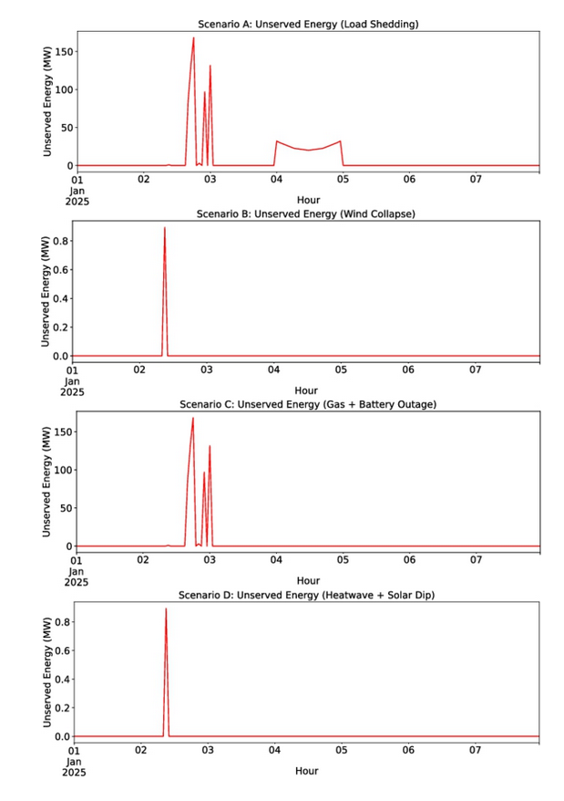
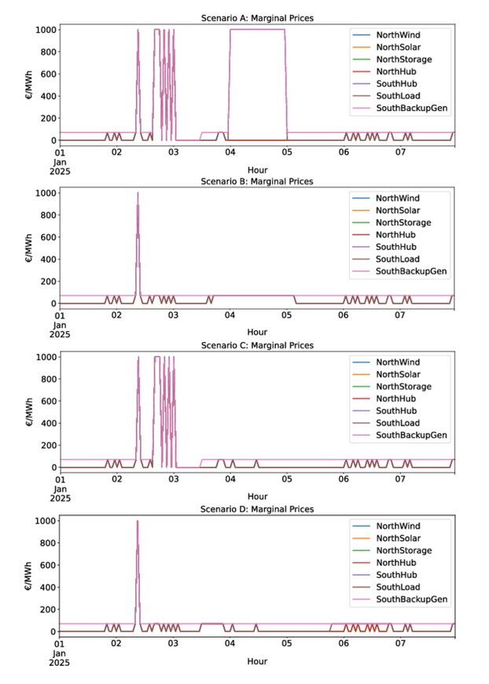
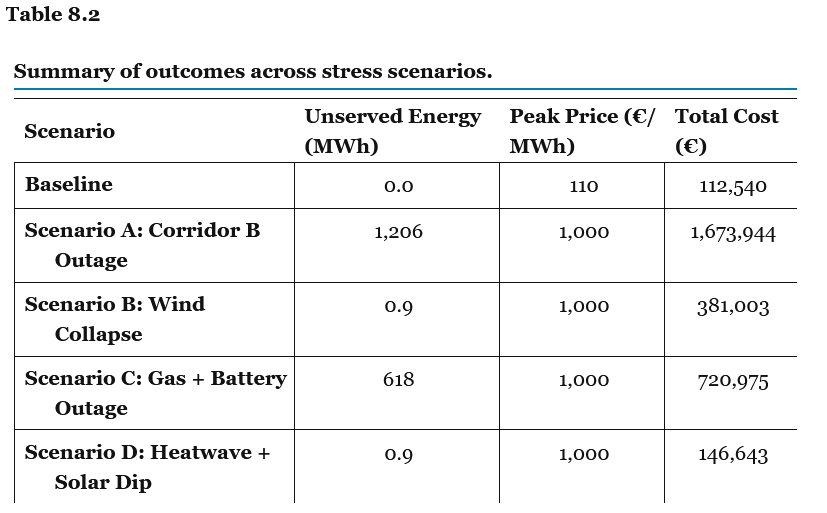
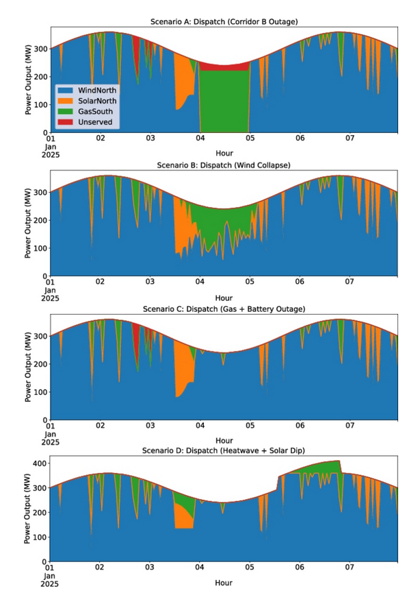
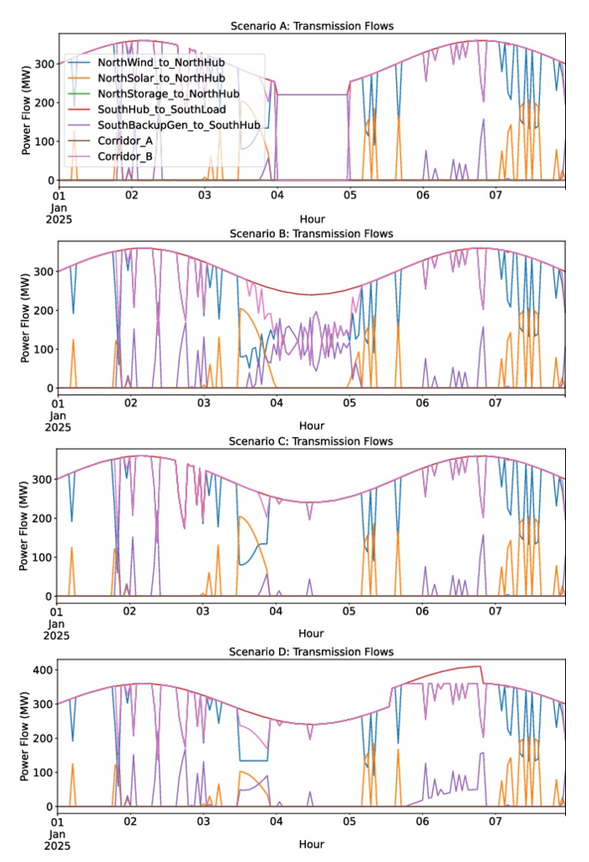

#### Chapter 8:
# **Reliability and resilience in power systems**
 
> Αυτό το κεφάλαιο αξιολογεί την αξιοπιστία και την ανθεκτικότητα των σύγχρονων ηλεκτρικών δικτύων, χρησιμοποιώντας την πλατφόρμα μοντελοποίησης PyPSA για την εκτέλεση σεναρίων ακραίας καταπόνησης (stress tests) σε ένα σταθερό σύστημα.
Τα βασικά συμπεράσματα είναι:
- Οι πιο σοβαρές καταρρεύσεις του συστήματος δεν οφείλονται στη μεταβλητότητα των Ανανεώσιμων Πηγών Ενέργειας (ΑΠΕ), αλλά σε δομικές αδυναμίες, όπως τα σημεία συμφόρησης του δικτύου και η ταυτόχρονη απώλεια ευελιξίας.
- Η πραγματική ανθεκτικότητα δεν επιτυγχάνεται απλώς με την προσθήκη νέας χωρητικότητας, αλλά απαιτεί πλεονασμό (redundancy), χωρική ευελιξία και λειτουργία με γνώμονα την ασφάλεια, κάτι που καταδεικνύεται πρακτικά στο τέλος του κεφαλαίου μέσω μιας μελέτης SCOPF (Security-Constrained Optimal Power Flow).


### Κύρια Σημεία Κεφαλαίου
- **Η αξιοπιστία ξεπερνά την επάρκεια**Απαιτεί την πρόβλεψη και την επιβίωση από ξαφνικές διαταραχές, όχι απλώς την εξισορρόπηση της μέσης προσφοράς και ζήτησης.
- **Η ουσία της ανθεκτικότητας**Δεν αφορά την πλήρη αποφυγή των αποτυχιών, αλλά την απορρόφηση των κραδασμών (shocks) και τη γρήγορη ανάκαμψη χωρίς εκτεταμένη απώλεια υπηρεσιών.
- **Στοχευμένη προσομοίωση**Χρησιμοποιούνται σενάρια ακραίας καταπόνησης (stress tests) σε ένα ήδη βελτιστοποιημένο σύστημα, ώστε να εντοπιστούν με ακρίβεια τα όρια αντοχής του («πού λυγίζει και πού σπάει»).
- **Κρίσιμες αδυναμίες**Οι σημαντικότερες ευπάθειες εμφανίζονται όταν αφαιρούνται οι επιλογές ευελιξίας (φυσικό αέριο, αποθήκευση) ή ο πλεονασμός του δικτύου (redundancy).
- **Οικονομικός αντίκτυπος**Ακόμη και μια ελάχιστη έλλειψη ενέργειας (unserved energy) μπορεί να πυροδοτήσει ακραίες αυξήσεις στις τιμές, αναδεικνύοντας πόσο στενά είναι τα επιχειρησιακά περιθώρια.
- **αξία των stress tests**Οι δοκιμές αντοχής βάσει σεναρίων αποτελούν απαραίτητο συμπλήρωμα των μοντέλων σχεδιασμού, καθώς αποκαλύπτουν ρίσκα και συμβιβασμούς (trade-offs) που η στατική βελτιστοποίηση κόστους αδυνατεί να εντοπίσει.

> Το κεφάλαιο εξετάζει την αξιοπιστία και ανθεκτικότητα του ηλεκτρικού συστήματος που σχεδιάστηκε στο προηγούμενο κεφάλαιο, ελέγχοντας πώς ανταποκρίνεται σε πραγματικές διαταραχές όπως βλάβες γεννητριών, ακραία καιρικά φαινόμενα και μεταβολές στην παραγωγή ΑΠΕ. Αντί να επανασχεδιάσει το δίκτυο, χρησιμοποιεί τις ήδη καθορισμένες υποδομές και μέσω προσομοιώσεων στο PyPSA αξιολογεί τις τεχνικές, οικονομικές και κοινωνικές επιπτώσεις πιθανών αστοχιών, όπως αποκοπές φορτίου, αυξήσεις κόστους και διακυμάνσεις τιμών.

---
### 8.2 Concepts of reliability and resilience

#### 1. Αξιοπιστία (Reliability)

Η αξιοπιστία ενός συστήματος ηλεκτρικής ενέργειας παραδοσιακά χωρίζεται σε δύο διαστάσεις:
- Επάρκεια (Adequacy): Η ικανότητα του συστήματος να καλύπτει τη ζήτηση υπό φυσιολογικές και αναμενόμενες συνθήκες. Σημαίνει απλώς ότι η εγκατεστημένη ισχύς (ΑΠΕ ή συμβατικές μονάδες) επαρκεί με βάση τις προβλέψεις.
- Ασφάλεια (Security): Η ικανότητα του συστήματος να αντέχει σε ξαφνικές διαταραχές (π.χ. η απώλεια μιας γραμμής μεταφοράς, το σφάλμα μιας γεννήτριας ή μια απότομη πτώση της παραγωγής των ΑΠΕ λόγω καιρού). Παραδοσιακά, αυτό ελέγχεται με το κριτήριο N-1: το σύστημα πρέπει να συνεχίσει να λειτουργεί ομαλά ακόμη και αν τεθεί εκτός λειτουργίας ένα (οποιοδήποτε) στοιχείο του.

#### 2. Ανθεκτικότητα (Resilience): Η Νέα Αναγκαιότητα

Λόγω της κλιματικής αλλαγής (ακραία καιρικά φαινόμενα), της μεγάλης διείσδυσης των ΑΠΕ και των νέων φορτίων (π.χ. φόρτιση ηλεκτρικών οχημάτων), η παραδοσιακή ασφάλεια δεν αρκεί. Χρειαζόμαστε την Ανθεκτικότητα.
- Resilience είναι η ικανότητα του δικτύου όχι μόνο να αντέχει τα σοκ, αλλά να προσαρμόζεται σε αυτά και να ανακάμπτει γρήγορα με την ελάχιστη δυνατή απώλεια υπηρεσιών. Δέχεται ότι κάποιες αστοχίες είναι αναπόφευκτες και εστιάζει στην ελαχιστοποίηση των συνεπειών τους.

|Χαρακτηριστικό|Αξιοπιστία (Reliability)|Ανθεκτικότητα (Resilience)|
|:----------|:--------:|:----------|
|Κύριος Στόχος|Διατήρηση της ισορροπίας υπό κανονικές ή προβλέψιμες συνθήκες (Κριτήριο Ν-1)|"Απορρόφηση ακραίων σοκ, προσαρμογή και ταχεία ανάνηψη (Recovery)."|
|Αντιμετώπιση Αστοχιών|Προσπαθεί να τις αποτρέψει.|Αποδέχεται ότι θα συμβούν και προσπαθεί να μειώσει τον αντίκτυπο.|
|Τύπος Απειλών|"Συνήθεις, εντοπισμένες και βραχυπρόθεσμες βλάβες."|"Σπάνιες, εκτεταμένες και συστημικές απειλές (π.χ. κλιματική κρίση)."|

- Αντί να ρωτάμε: «Είναι το σύστημα βιώσιμο υπό κανονικές συνθήκες;»
- Ρωτάμε: «Τι θα συμβεί αν καταρρεύσει ένα κρίσιμο στοιχείο; Πόσο σοβαρό θα είναι το πλήγμα στην τροφοδοσία; Τι μηχανισμοί άμυνας υπάρχουν (πλεονασμός, γεωγραφική διασπορά, ευελιξία);»

> Το κεντρικό ερώτημα του κεφαλαίου: Ποιες είναι οι οικονομικές υποχωρήσεις (trade-offs) μεταξύ της επένδυσης σε αυτούς τους μηχανισμούς άμυνας (buffers) έναντι της αποδοχής μιας ελεγχόμενης υποβάθμισης των υπηρεσιών του δικτύου;

---
### 8.3 Methodology for stress testing

Η μεθοδολογία του stress testing βασίζεται στο βελτιστοποιημένο ενεργειακό σύστημα του Κεφαλαίου 7, όπου οι εγκατεστημένες ισχείς παραγωγής, αποθήκευσης και μεταφοράς «παγώνουν» στις βέλτιστες τιμές τους ώστε να αξιολογηθεί η ανθεκτικότητα του ήδη κατασκευασμένου δικτύου και όχι να επανασχεδιαστεί. Στη συνέχεια εφαρμόζονται προκαθορισμένα σενάρια διαταραχών, όπως βλάβες γραμμών μεταφοράς, μειωμένη παραγωγή από ΑΠΕ, αστοχίες μονάδων και αυξημένη ζήτηση, μέσω χρονικά μεταβαλλόμενων περιορισμών που επηρεάζουν την παραγωγή, τη μεταφορά ή τη ζήτηση.

Για την ανίχνευση αδυναμίας κάλυψης του φορτίου, προστίθεται ένας εικονικός generator load shedding με πολύ υψηλό κόστος λειτουργίας, ο οποίος αναπαριστά μη εξυπηρετούμενη ενέργεια (“unserved energy”). Έτσι το PyPSA μπορεί πάντα να βρίσκει εφικτή λύση, ενώ η ποσότητα της αποκοπής φορτίου χρησιμοποιείται ως βασικός δείκτης αξιοπιστίας και ανθεκτικότητας του συστήματος υπό συνθήκες πίεσης.

##### Listing 8.1: Fixing component capacities before stress testing.
```python
network.generators.p_nom = network.generators.p_nom_opt
network.generators.p_nom_extendable = False

network.links.p_nom = network.links.p_nom_opt
network.links.p_nom_extendable = False

network.storage_units.p_nom = network.storage_units.p_nom_opt
network.storage_units.p_nom_extendable = False

```

Listing 8.2: Adding an unserved energy generator.
```python
network.add("Generator", "Unserved",
            bus="SouthLoad",
            p_nom_extendable=True,
            marginal_cost=1000,
            carrier="load_shed")
```

> #### Δοκιμές Αντοχής του Δικτύου (Stress Testing)
> -Stress Testing: Στα συστήματα ηλεκτρικής ενέργειας, οι δοκιμές αντοχής αναφέρονται στη σκόπιμη έκθεση του μοντέλου του δικτύου σε δυσμενείς ή ακραίες συνθήκες με σκοπό την αξιολόγηση της στιβαρότητάς του (robustness).
>- Αυτές οι προσομοιώσεις αποτελούν ένα «crash test» για το σύστημα, βοηθώντας τους μηχανικούς να εντοπίσουν τις κρυφές ευπάθειες και να αξιολογήσουν κατά πόσο το δίκτυο μπορεί να διατηρήσει τη συνέχεια της τροφοδοσίας όταν τα πράγματα πάνε στραβά.
> -Τυπικά Σενάρια Ακραίας Καταπόνησης
> - Το μοντέλο δοκιμάζεται απέναντι σε ακραία γεγονότα, όπως:
>       -Απώλειες Γραμμών (Line outages): Ξαφνική έξοδος κρίσιμων διασυνδέσεων ή διαδρόμων μεταφοράς.
>       -Αιχμές Ζήτησης (Demand spikes): Απρόβλεπτη και απότομη αύξηση της κατανάλωσης (π.χ. λόγω ακραίων θερμοκρασιών).
>       -Καταρρεύσεις Παραγωγής ΑΠΕ (Renewable generation failures): Απότομη πτώση της αιολικής ή ηλιακής παραγωγής (π.χ. λόγω ξαφνικής άπνοιας ή συννεφιάς).

> #### Πώς Υλοποιείται στο PyPSA;
> - Στο περιβάλλον του PyPSA, η διαδικασία αυτή δεν απαιτεί το ξαναχτίσιμο του δικτύου από την αρχή, αλλά την τροποποίηση του υπάρχοντος βελτιστοποιημένου μοντέλου:
>
>       - Τροποποίηση Δεδομένων Εισόδου (Input Modification): Μεταβάλλονται οι χρονοσειρές της διαθεσιμότητας των ΑΠΕ, μειώνονται τα όρια χωρητικότητας των γραμμών μεταφοράς ή αυξάνονται τα φορτία ζήτησης.
>       - Επιβολή Επιπλέον Περιορισμών (Constraints): Εισάγονται νέοι μαθηματικοί περιορισμοί στο μοντέλο γραμμικού προγραμματισμού (π.χ. αναγκαστική έξοδος μιας γεννήτριας).

> Το Αποτέλεσμα: Το PyPSA επιλύει εκ νέου το πρόβλημα της βέλτιστης κατανομής (dispatch optimization) υπό αυτές τις νέες, πιεσμένες συνθήκες. Στη συνέχεια, αναλύονται οι αλλαγές στην κατανομή φορτίου, οι διακυμάνσεις του κόστους (marginal prices) και οι δείκτες αξιοπιστίας (όπως η μη εξυπηρετούμενη ενέργεια - unserved energy) για να ποσοτικοποιηθεί η ζημιά.


> #### Unserved Energy
> Η μη εξυπηρετούμενη ενέργεια (Unserved Energy) αναφέρεται στην ποσότητα ηλεκτρικής ζήτησης που το σύστημα ηλεκτρικής ενέργειας αδυνατεί να καλύψει λόγω ανεπαρκούς παραγωγής, περιορισμών μεταφοράς ή λειτουργικών προβλημάτων. Αποτελεί βασικό δείκτη αξιοπιστίας ενός ενεργειακού συστήματος, μετριέται συνήθως σε MWh και δείχνει πόση ζήτηση παραμένει ακάλυπτη σε συνθήκες πίεσης ή βλαβών.

> Στο PyPSA, η unserved energy μοντελοποιείται μέσω ενός εικονικού generator load shedding με πολύ υψηλό οριακό κόστος. Όταν το σύστημα δεν μπορεί να καλύψει πλήρως το φορτίο, ενεργοποιείται αυτός ο generator, επιτρέποντας στο μοντέλο να παραμένει εφικτό και ταυτόχρονα αποκαλύπτοντας αδυναμίες στην ανθεκτικότητα και αξιοπιστία του δικτύου υπό σενάρια διαταραχών.

---

### 8.4 Scenario definitions

Η αξιολόγηση αξιοπιστίας του κεφαλαίου βασίζεται σε τέσσερα προσεκτικά σχεδιασμένα σενάρια stress testing, τα οποία αναπαριστούν διαφορετικές λειτουργικές ευπάθειες που εμφανίζονται συχνά στα σύγχρονα ηλεκτρικά συστήματα με υψηλή διείσδυση ΑΠΕ και περιορισμένη ευελιξία. Τα σενάρια αυτά εξετάζουν καταστάσεις όπως διακοπές κρίσιμων γραμμών μεταφοράς, παρατεταμένη χαμηλή αιολική παραγωγή, ταυτόχρονες αστοχίες μονάδων ευελιξίας και ακραίες κλιματικές συνθήκες που αυξάνουν τη ζήτηση και μειώνουν την παραγωγή.

Όλα τα σενάρια εφαρμόζονται πάνω στο ίδιο βασικό μοντέλο του Κεφαλαίου 7, ώστε οι διαφορές στα αποτελέσματα να οφείλονται αποκλειστικά στις χρονικά μεταβαλλόμενες αλλαγές στη διαθεσιμότητα των στοιχείων του συστήματος. Με αυτόν τον τρόπο αξιολογείται αν ο οικονομικά βέλτιστος σχεδιασμός του δικτύου παραμένει επαρκώς ανθεκτικός και αξιόπιστος κάτω από δυσμενείς συνθήκες λειτουργίας.

#### 8.4.1 Scenario A: corridor B outage
> **Το Σενάριο Α προσομοιώνει την προσωρινή διακοπή λειτουργίας του Corridor B, του βασικού διαδρόμου μεταφοράς ηλεκτρικής ενέργειας μεταξύ των περιοχών NorthGrid και SouthGrid. Για χρονικό διάστημα 24 ωρών (από την ώρα 72 έως την ώρα 96), η γραμμή τίθεται πλήρως εκτός λειτουργίας, αναπαριστώντας μια τυπική διαταραχή τύπου N-1 που μπορεί να προκληθεί από βλάβη, συντήρηση ή ακραία καιρικά φαινόμενα**.

> Στόχος του σεναρίου είναι να αξιολογηθεί ο βαθμός εξάρτησης του συστήματος από τον συγκεκριμένο διάδρομο μεταφοράς για τη διατήρηση της ισορροπίας ισχύος μεταξύ των δύο περιοχών. Αν η διακοπή οδηγήσει σε αποκοπές φορτίου, ενεργοποίηση ακριβών εφεδρικών μονάδων ή σημαντική αύξηση του λειτουργικού κόστους, τότε αποκαλύπτεται ότι το δίκτυο παρουσιάζει περιορισμένη ανθεκτικότητα και υπερβολική εξάρτηση από έναν μόνο κρίσιμο διάδρομο μεταφοράς.

> - **Η ασφάλεια N-1 (N-1 security) είναι ένα βασικό κριτήριο αξιοπιστίας στα ηλεκτρικά συστήματα, σύμφωνα με το οποίο το δίκτυο πρέπει να συνεχίζει να λειτουργεί κανονικά ακόμη και αν ένα μεμονωμένο στοιχείο — όπως μια γραμμή μεταφοράς ή μια μονάδα παραγωγής — τεθεί ξαφνικά εκτός λειτουργίας. Η έννοια αυτή αποτελεί θεμελιώδη αρχή στον σχεδιασμό και τη λειτουργία ασφαλών συστημάτων μεταφοράς ηλεκτρικής ενέργειας.**

> - Στο PyPSA, η μοντελοποίηση της ασφάλειας N-1 πραγματοποιείται συνήθως μέσω διατυπώσεων Security-Constrained Optimal Power Flow (SCOPF), όπου η βελτιστοποίηση λαμβάνει υπόψη πιθανά σενάρια αστοχίας (contingencies). Με αυτόν τον τρόπο αξιολογείται αν το σύστημα μπορεί να διατηρήσει την παροχή ηλεκτρικής ενέργειας χωρίς αποκοπές φορτίου ή σοβαρές παραβιάσεις περιορισμών ακόμη και μετά από μία κρίσιμη βλάβη.

#### 8.4.2 Scenario B: wind generation collapse
> **Το σενάριο αυτό προσομοιώνει ένα μετεωρολογικό φαινόμενο που προκαλεί σημαντική μείωση της αιολικής παραγωγής σε ολόκληρη την περιοχή NorthGrid. Από την ώρα 60 έως την ώρα 100 της προσομοίωσης, η διαθεσιμότητα των αιολικών μονάδων περιορίζεται στο 30% της κανονικής τους παραγωγής, αναπαριστώντας συνθήκες παρατεταμένης άπνοιας ή την επίδραση ενός ισχυρού μετωπικού συστήματος. Όλα τα υπόλοιπα στοιχεία του συστήματος, όπως οι μονάδες φυσικού αερίου, τα φωτοβολταϊκά και οι γραμμές μεταφοράς, παραμένουν πλήρως διαθέσιμα.**

> Βασικός στόχος του σεναρίου είναι να αξιολογηθεί κατά πόσο το σύστημα μπορεί να ανταποκριθεί σε μια παρατεταμένη πτώση της παραγωγής από ΑΠΕ. Εξετάζεται αν οι ευέλικτες μονάδες παραγωγής, τα συστήματα αποθήκευσης και οι εισαγωγές ενέργειας από άλλες περιοχές μπορούν να διατηρήσουν την ισορροπία προσφοράς και ζήτησης, καθώς και ποιο είναι το οικονομικό κόστος αυτής της προσαρμογής.

> Το σενάριο αυτό αναδεικνύει μία από τις βασικές προκλήσεις των σύγχρονων ενεργειακών συστημάτων: την ενσωμάτωση μεταβλητών ανανεώσιμων πηγών χωρίς να υποβαθμίζεται η αξιοπιστία του δικτύου. Τα αποτελέσματα δείχνουν αν το σύστημα διαθέτει επαρκή εφεδρεία και λειτουργική ευελιξία ώστε να αντιμετωπίσει τη μεταβλητότητα της αιολικής παραγωγής χωρίς αποκοπές φορτίου ή έντονες αυξήσεις στις τιμές ηλεκτρικής ενέργειας.

#### 8.4.3 Scenario C: combined gas and storage outage
> **Το σενάριο αυτό εξετάζει την απόκριση του συστήματος σε ταυτόχρονες διαταραχές δύο κρίσιμων πηγών λειτουργικής ευελιξίας: μιας μονάδας φυσικού αερίου και ενός συστήματος αποθήκευσης με μπαταρίες. Συγκεκριμένα, η μονάδα φυσικού αερίου στο SouthGrid τίθεται εκτός λειτουργίας για προγραμματισμένη συντήρηση από την ώρα 40 έως την ώρα 60, ενώ η μπαταρία στο NorthGrid καθίσταται μη διαθέσιμη από την ώρα 90 έως την ώρα 114 λόγω βλάβης.**

> Σε αντίθεση με ένα κλασικό σενάριο N-1, εδώ εξετάζονται διαδοχικές αλλά αλληλεπικαλυπτόμενες αστοχίες σε δύο διαφορετικές τεχνολογίες ευελιξίας. Η μονάδα φυσικού αερίου παρέχει αξιόπιστη και άμεσα διαθέσιμη παραγωγή σε περιόδους χαμηλής παραγωγής ΑΠΕ, ενώ η μπαταρία συμβάλλει στην εξομάλυνση βραχυχρόνιων διακυμάνσεων, στη μετατόπιση φορτίου και στη σταθεροποίηση των τιμών.

> Ο στόχος του σεναρίου είναι να αξιολογηθεί αν το σύστημα διαθέτει επαρκή εναπομένουσα ευελιξία ώστε να συνεχίσει να καλύπτει τη ζήτηση υπό πολλαπλές διαταραχές. Αν η απουσία αυτών των δύο στοιχείων οδηγήσει σε αποκοπές φορτίου, αυξημένη μεταβλητότητα τιμών ή μη εξυπηρετούμενη ενέργεια, τότε αποκαλύπτεται ότι λειτουργούσαν ως κρίσιμα «μαξιλάρια ανθεκτικότητας» και ότι το βέλτιστο οικονομικά σύστημα παρουσιάζει περιορισμένο επίπεδο εφεδρείας και πλεονασμού.

#### 8.4.4 Scenario D: heat wave and solar reduction
> **Το Σενάριο Δ εισάγει ένα σύνθετο κλιματικό γεγονός που επηρεάζει ταυτόχρονα τόσο τη ζήτηση ηλεκτρικής ενέργειας όσο και την παραγωγή από ανανεώσιμες πηγές. Μεταξύ των ωρών 110 και 140, ένα προσομοιωμένο κύμα καύσωνα αυξάνει τη ζήτηση κατά περίπου 50 MW λόγω αυξημένης χρήσης κλιματιστικών, ενώ παράλληλα η διαθεσιμότητα της ηλιακής παραγωγής μειώνεται κατά 50% από την ώρα 50 έως την ώρα 80 εξαιτίας έντονης νεφοκάλυψης ή συννεφιάς.**

> Σε αντίθεση με τα προηγούμενα σενάρια, εδώ δεν υπάρχει βλάβη συγκεκριμένου εξοπλισμού, αλλά μια περιβαλλοντική διαταραχή που προκαλεί ταυτόχρονα αύξηση της ζήτησης και μείωση της διαθέσιμης παραγωγής. Τέτοιου είδους σύνθετα κλιματικά φαινόμενα εμφανίζονται ολοένα συχνότερα στα σύγχρονα ενεργειακά συστήματα λόγω της κλιματικής αλλαγής.

> Το σενάριο αξιολογεί αν το σύστημα διαθέτει επαρκή περιθώρια ευελιξίας ώστε να αντιμετωπίσει ταυτόχρονες πιέσεις χωρίς την ανάγκη έκτακτων μέτρων. Αν η απόκριση του συστήματος οδηγήσει σε έντονες αυξήσεις τιμών, αποκοπές φορτίου ή αναποτελεσματική ανακατανομή παραγωγής, τότε αυτό υποδηλώνει ότι ο αρχικός οικονομικά βέλτιστος σχεδιασμός ήταν προσανατολισμένος κυρίως σε κανονικές συνθήκες λειτουργίας και δεν διαθέτει επαρκή ανθεκτικότητα απέναντι σε ακραία κλιματικά γεγονότα.

**Συνολικά, τα τέσσερα σενάρια καλύπτουν διαφορετικές μορφές λειτουργικής πίεσης — χωρικές, χρονικές, τεχνικές και περιβαλλοντικές — και παρέχουν ένα ολοκληρωμένο πλαίσιο αξιολόγησης της ανθεκτικότητας του συστήματος. Στις επόμενες ενότητες, τα σενάρια υλοποιούνται μέσω στοχευμένων μεταβολών στη διαθεσιμότητα των στοιχείων του δικτύου και επιλύονται με τη μέθοδο network.optimize(), ώστε να αναλυθούν δείκτες όπως η κατανομή παραγωγής, οι οριακές τιμές, η μη εξυπηρετούμενη ενέργεια και το συνολικό λειτουργικό κόστος.**

### Πίνακας 8.1: Ταξινόμηση τύπων καταπόνησης (stress) των σεναρίων.

| Σενάριο | Περιγραφή | Κύρια Κατηγορία Καταπόνησης |
| :--- | :--- | :--- |
| **Σενάριο A** | Διακοπή λειτουργίας του Διαδρόμου Β (Corridor B) μεταξύ NorthGrid και SouthGrid. | **Χωρική** (Συμφόρηση δικτύου μεταφοράς / transmission bottleneck) |
| **Σενάριο B** | Μείωση μεγάλης κλίμακας της αιολικής παραγωγής στο NorthGrid. | **Χρονική** (Μεταβλητότητα/διαλείπουσα φύση των ΑΠΕ) |
| **Σενάριο C** | Ταυτόχρονη (επικαλυπτόμενη) διακοπή λειτουργίας μονάδας φυσικού αερίου και συστήματος μπαταριών. | **Υποδομής** (Απώλεια ευελιξίας) |
| **Σενάριο D** | Καύσωνας με ταυτόχρονη μείωση της ηλιακής παραγωγής και αιχμή του φορτίου ζήτησης. | **Περιβαλλοντική** (Συνδυασμένη καταπόνηση λόγω κλίματος) |

---

### 8.5 Implementation in PyPSA
Οι δοκιμές αντοχής βασίζονται στο ήδη βελτιστοποιημένο δίκτυο του Κεφαλαίου 7, «παγώνοντας» κάθε νέα επένδυση ή επέκταση της χωρητικότητάς του. Αυτό εξασφαλίζει ένα κοινό σημείο αναφοράς, ώστε οι όποιες διαφορές στην απόδοση να οφείλονται αποκλειστικά στα επιβαλλόμενα σενάρια ακραίας καταπόνησης.

##### 8.5.1 Adding a proxy for load shedding
```python
network.add("Generator", "Unserved",
            bus="SouthLoad",
            p_nom_extendable=True,
            marginal_cost=1000,
            carrier="load_shed")
```

Σε αντίθεση με το Κεφάλαιο 7, εδώ εισάγεται μια τεχνητή γεννήτρια-φάντασμα (load-shedding proxy) με το όνομα "Unserved" στον κόμβο SouthLoad.
- Απεριόριστη Χωρητικότητα (p_nom_extendable=True): Μπορεί να «παράγει» όση ενέργεια χρειαστεί για να μην καταρρεύσει μαθηματικά το μοντέλο.
- Ακραίο Κόστος (marginal_cost=1000): Έχει οριστεί στα 1000 €/MWh, τιμή πολύ υψηλότερη από οποιαδήποτε πραγματική μονάδα του δικτύου. Το μοντέλο θα τη χρησιμοποιήσει μόνο ως έσχατη λύση.

> **Ο Στόχος: Όταν το δίκτυο ζορίζεται και δεν μπορεί να καλύψει τη ζήτηση, ο αλγόριθμος ενεργοποιεί αυτή την πανάκριβη γεννήτρια. Έτσι, το μοντέλο δεν «κρασάρει» (παραμένει feasible), αλλά η ενέργεια που παράγεται από αυτήν καταγράφεται αμέσως ως Μη Εξυπηρετούμενη Ενέργεια (Unserved Energy), αποτελώντας τον βασικό δείκτη μέτρησης της αποτυχίας του συστήματος.**


--- 

### 8.5.2 Scenario-specific inputs
Αυτή η ενότητα περιγράφει τη μεθοδολογία με την οποία εισάγονται οι διάφορες βλάβες και τα σενάρια ακραίας καταπόνησης στο μοντέλο PyPSA.

Η βασική φιλοσοφία είναι ότι δεν αλλάζει η δομή του δικτύου (ονομαστικές χωρητικότητες), αλλά τροποποιούνται δυναμικά οι παράμετροι λειτουργίας μέσω χρονοσειρών της βιβλιοθήκης pandas (pandas.Series), οι οποίες είναι συγχρονισμένες με τα βήματα προσομοίωσης (snapshots).
Πώς Μοντελοποιείται κάθε Διαταραχή;
- **Διακοπή Λειτουργίας Γραμμών Μεταφοράς (π.χ. Σενάριο Α - Corridor B)**:
    Μηδενίζεται η παράμετρος p_max_pu (μέγιστη ανά μονάδα ισχύς) της συγκεκριμένης γραμμής/διασύνδεσης κατά τη διάρκεια του παραθύρου της βλάβης. Αυτό απαγορεύει πλήρως τη ροή ισχύος από αυτόν τον διάδρομο, αφήνοντας το υπόλοιπο δίκτυο ανέπαφο.
- **Απώλεια Γεννητριών ή Αποθήκευσης (π.χ. Συντήρηση ή Βλάβη Μπαταρίας)**:
    Η διαθεσιμότητα περιορίζεται μερικώς ή πλήρως, τροποποιώντας επίσης το πεδίο p_max_pu ή την αντίστοιχη χρονοσειρά διαθεσιμότητας για τις συγκεκριμένες ώρες, χωρίς να μεταβάλλεται η ονομαστική ισχύς της μονάδας.
- **Πτώση Παραγωγής ΑΠΕ (π.χ. Σενάριο Β - Μείωση Αιολικών ή Σενάριο D - Μείωση Ηλιακών)**:
    Γίνεται υποβιβασμός (scaling down) των προφίλ διαθεσιμότητας ανά μονάδα (p_max_pu) των αντίστοιχων τεχνολογιών ΑΠΕ, αποκλειστικά για τις ώρες που διαρκεί η κρίση. Μετά το πέρας του παραθύρου, οι τιμές επιστρέφουν στα επίπεδα αναφοράς.
- **Αιχμές Ζήτησης / Καύσωνες (π.χ. Σενάριο D)**:
    Τροποποιείται απευθείας η χρονοσειρά του φορτίου (load) στους επηρεαζόμενους κόμβους. Προστίθεται μια σταθερή ή μεταβαλλόμενη τιμή (offset) πάνω στην αρχική ζήτηση για να αποτυπωθεί, για παράδειγμα, η αυξημένη κατανάλωση λόγω κλιματισμού.

Το Πλεονέκτημα της Σπονδυλωτής (Modular) Προσέγγισης
- **Modular Injection: Πριν από την επίλυση κάθε σεναρίου, η αντίστοιχη τροποποιημένη χρονοσειρά «εγχέεται» στο μοντέλο.**

Αυτή η μέθοδος διασφαλίζει ότι:
- Εφαρμόζεται μόνο η επιθυμητή διαταραχή κάθε φορά, διατηρώντας το υπόλοιπο σύστημα σταθερό.
- Τα αποτελέσματα είναι απόλυτα συγκρίσιμα μεταξύ τους.
- Διευκολύνεται η εκτέλεση αναλύσεων ευαισθησίας (sensitivity analyses) ή μελλοντικών πειραμάτων.


### 8.6 Results and analysis


<div class="container">
  
</div>


> Σενάριο Α (Απώλεια Διαδρόμου Μεταφοράς - Corridor B): Η διακοπή της διασύνδεσης προκαλεί άμεση αδυναμία μεταφοράς ενέργειας. Αυτό οδηγεί σε μια τεράστια αιχμή έλλειψης (~170 MW) την ώρα 03, ενώ το πρόβλημα επιμένει ως «πλατώ» (~35 MW) μεταξύ των ωρών 04 και 05, δείχνοντας ότι το δίκτυο δυσκολεύεται να αναδρομολογήσει την ισχύ.

> Σενάριο Β (Κατάρρευση Αιολικής Παραγωγής) & Σενάριο D (Καύσωνας + Πτώση Ηλιακών): Και τα δύο σενάρια εμφανίζουν την ίδια ακριβώς συμπεριφορά: μια μοναδική, πολύ σύντομη και μικρή αιχμή την ώρα 02. Αυτό αποδεικνύει ότι το βελτιστοποιημένο σύστημα διαθέτει επαρκή χωρική διασπορά, αποθήκευση ή συμβατικές εφεδρείες για να απορροφήσει σχεδόν εξολοκλήρου την απώλεια των ΑΠΕ ή την άνοδο της ζήτησης.

> Σενάριο C (Ταυτόχρονη Απώλεια Φυσικού Αερίου & Μπαταρίας): Η ταυτόχρονη απώλεια αυτών των δύο κρίσιμων στοιχείων ευελιξίας προκαλεί εξίσου βίαιο σοκ την ώρα 03 (~170 MW). Η διαφορά με το Σενάριο Α είναι ότι εδώ έχουμε μια δεύτερη, πολύ υψηλή αιχμή αμέσως μετά (~130 MW), γεγονός που μαρτυρά την πλήρη αδυναμία του συστήματος να καλύψει το κενό ισχύος χωρίς τις εφεδρείες της μπαταρίας και του αερίου.

---

<div class="container">
  
</div>

> Το πιο ξεκάθαρο κοινό εύρημα σε όλα τα σενάρια είναι η συμπεριφορά των στοιχείων του Βορρά:
- Οι τιμές στα NorthWind, NorthSolar, NorthStorage και NorthHub παραμένουν χαμηλές και σταθερές σε όλη τη διάρκεια της εβδομάδας (1-7 Ιανουαρίου).
> Γιατί συμβαίνει αυτό;
- Αφθονία Φθηνής Παραγωγής: Ο Βορράς είναι πλούσιος σε φθηνή πράσινη ενέργεια (αιολικά/ηλιακά) και διαθέτει αποθήκευση για να εξομαλύνει τις διακυμάνσεις.
- Μόνωση από τα Σοκ: Όταν ο Νότος υποφέρει από έλλειψη (είτε λόγω απώλειας γεννητριών είτε λόγω καύσωνα), ο Βορράς δεν επηρεάζεται οικονομικά, επειδή οι γραμμές μεταφοράς προς τον Νότο είτε έχουν κοπεί (Σενάριο Α) είτε έχουν φτάσει στο μέγιστο όριο χωρητικότητάς τους (συμφόρηση - congestion). Η φθηνή ενέργεια εγκλωβίζεται στον Βορρά, κρατώντας τις εκεί τιμές χαμηλές, ενώ ο Νότος «φλέγεται» οικονομικά.

---

<div class="container">
  
</div>

Οικονομική και Δομική Ανάλυση των Σεναρίων (Συμπεράσματα)

Η ανάλυση των οριακών τιμών και της συμπεριφοράς του δικτύου αποκαλύπτει τους μηχανισμούς με τους οποίους οι διαφορετικοί τύποι καταπόνησης επηρεάζουν το σύστημα:
#### 1. Σενάριο Α vs. Σενάριο C: Το Επιπλέον Κόστος της Γεωγραφικής Απομόνωσης

Αν και τα Σενάρια Α και C εμφανίζουν παρόμοιο προφίλ ακραίων τιμών (τιμές οροφής - price caps), το Σενάριο Α (Διακοπή Διαδρόμου Β) αποδεικνύεται το πιο καταστροφικό, οδηγώντας σε:

    Μεγαλύτερη συνολική μη εξυπηρετούμενη ενέργεια.

    Υψηλότερο συνολικό κόστος συστήματος (Total System Cost).

    Ο Μηχανισμός: Το Σενάριο Α συνδυάζει την έλλειψη ισχύος με τον χωρικό αποκλεισμό. Κόβοντας την κύρια αρτηρία μεταφοράς, ο Νότος απομονώνεται από την εξισορροπητική ικανότητα και τις φθηνές εισαγωγές του Βορρά. Έτσι, το σύστημα επιβαρύνεται διπλά: από την απόλυτη στενότητα πόρων και από το οικονομικό κόστος της συμφόρησης (congestion penalties).

#### 2. Σενάρια Β και D: Η Επιτυχής Αντιμετώπιση των Καιρικών Σοκ

Αντίθετα, οι καθαρά κλιματικές/καιρικές διαταραχές αποδεικνύουν τη στιβαρότητα του αρχικού σχεδιασμού:

    Σενάριο Β (Κατάρρευση Αιολικών): Οι τιμές εκτινάσσονται μόνο στιγμιαία. Το σύστημα σταθεροποιείται γρήγορα επιστρατεύοντας την ευελιξία των άλλων ζωνών (interzonal flexibility) και αντισταθμιστική παραγωγή (compensatory dispatch).

    Σενάριο D (Καύσωνας + Πτώση Ηλιακών): Παρά τον συνδυασμό υψηλής ζήτησης και μειωμένης ηλιακής ισχύος, οι αιχμές των τιμών είναι σύντομες και διασκορπισμένες σε διάφορους κόμβους, χωρίς να προκαλούν παρατεταμένη απόκλιση.

Το Συμπέρασμα: Οι καιρικές διακυμάνσεις, αν και προκλητικές, δεν ξεπερνούν το όριο της οικονομικής ανθεκτικότητας (resilience threshold) του δικτύου, εφόσον οι υποδομές μεταφοράς και οι μονάδες ευελιξίας παραμένουν άθικτες.
#### 3. Η Αξία των Οριακών Τιμών ως Διαγνωστικό Εργαλείο

Οι οριακές τιμές (marginal prices) δεν αποτυπώνουν απλώς την απόλυτη έλλειψη ενέργειας τη δεδομένη στιγμή. Λειτουργούν ως ένας εξαιρετικός «καθρέφτης» των αδυναμιών του συστήματος, καθώς αποκαλύπτουν:

    Τις περιφερειακές ανισορροπίες (regional imbalances) μεταξύ διαφορετικών ζωνών.

    Την ευαισθησία του δικτύου μεταφοράς (transmission sensitivity) σε αλλαγές της τοπολογίας του.

Αυτό τις καθιστά απαραίτητο εργαλείο για τους διαχειριστές, καθώς μπορούν να εντοπίσουν δομικά τρωτά σημεία που μπορεί να μην οδηγούν ακόμα σε ολική κατάρρευση (blackout), αλλά επιβαρύνουν το σύστημα με τεράστιο λειτουργικό και οικονομικό κόστος.

--- 

<div class="container">
  
</div>

#### Σενάριο Α: Αποκοπή Διαδρόμου Β (Corridor B Outage)
- Συμπεριφορά: Η παραγωγή βασίζεται στο WindNorth (Βορράς), με συνεισφορά από το SolarNorth και το GasSouth (Νότος).
- Το Πρόβλημα: Όταν η παραγωγή του WindNorth μειώνεται γύρω στην ώρα 04, το δίκτυο αδυνατεί να μεταφέρει επαρκή ενέργεια λόγω της κομμένης διασύνδεσης. Παρά τη λειτουργία της μονάδας φυσικού αερίου στον Νότο (GasSouth), εμφανίζεται η χαρακτηριστική μαύρη τρύπα της Μη Εξυπηρετούμενης Ενέργειας (Unserved Energy) μεταξύ των ωρών 04 και 05. Μόλις το WindNorth ανακάμψει, το σύστημα ισορροπεί ξανά.

#### Σενάριο Β: Κατάρρευση Αιολικών (Wind Collapse)
- Συμπεριφορά: Μεταξύ των ωρών 04 και 06, η παραγωγή του WindNorth σημειώνει κατακόρυφη πτώση.
- Η Αντίδραση: Εδώ βλέπουμε την επιτυχή λειτουργία των μηχανισμών ευελιξίας. Το SolarNorth και, κυρίως, η μονάδα φυσικού αερίου στον Νότο (GasSouth) αυξάνουν αμέσως και απότομα την παραγωγή τους, καλύπτοντας πλήρως το κενό της αιολικής ισχύος. Δεν σημειώνεται καμία απώλεια φορτίου, αποδεικνύοντας ότι το σύστημα έχει επαρκή εφεδρική ισχύ όταν το δίκτυο μεταφοράς είναι υγιές.

##### Σενάριο C: Απώλεια Φυσικού Αερίου και Μπαταρίας (Gas + Battery Outage)
- Συμπεριφορά: Το WindNorth κυριαρχεί απόλυτα σε όλη τη διάρκεια, ενώ η συνεισφορά του GasSouth είναι σχεδόν μηδενική (λόγω της βλάβης).
- Η Αντίδραση: Όταν εμφανίζεται μια μικρή βύθιση στο WindNorth γύρω στην ώρα 04, το σύστημα επιστρατεύει άμεσα το SolarNorth για να αντισταθμίσει την απώλεια. Επειδή η διασύνδεση Βορρά-Νότου λειτουργεί, η ηλιακή ενέργεια του Βορρά προφταίνει να σώσει την κατάσταση, περιορίζοντας τη ζημιά σε αντίθεση με το Σενάριο Α.

#### Σενάριο D: Καύσωνας και Πτώση Ηλιακών (Heatwave + Solar Dip)
- Συμπεριφορά: Πρόκειται για το πιο σύνθετο σενάριο, καθώς η ζήτηση εκτοξεύεται λόγω του καύσωνα, ξεπερνώντας σε αιχμή τα 400 MW (την υψηλότερη από όλα τα σενάρια) μεταξύ των ωρών 06 και 07. Ταυτόχρονα, το SolarNorth παρουσιάζει σημαντική βύθιση την ώρα 04.
- Η Αντίδραση: Το σύστημα πιέζεται στα όριά του. Το WindNorth παραμένει η βάση, αλλά η μονάδα GasSouth αναγκάζεται να δουλέψει στο μέγιστο των δυνατοτήτων της, πραγματοποιώντας μια τεράστια και παρατεταμένη «έγχυση» ισχύος για να υποστηρίξει το δίκτυο κατά την απογευματινή αιχμή του καύσωνα.

##### Γενικά Συμπεράσματα
> Η Σημασία του Φυσικού Αερίου (GasSouth): Στα σενάρια Β και D, η μονάδα αερίου λειτουργεί ως ο απόλυτος «πυροσβέστης» του συστήματος. Χωρίς αυτήν, οι καιρικές διακυμάνσεις και οι καύσωνες θα είχαν οδηγήσει σε εκτεταμένα blackouts.


> Δίκτυο εναντίον Παραγωγής: Η σύγκριση των γραφημάτων δείχνει ότι η απώλεια παραγωγής (Σενάριο Β) αντιμετωπίζεται εύκολα αν υπάρχει ελεύθερη χωρητικότητα στις γραμμές, αλλά η απώλεια δικτύου (Σενάριο Α) εγκλωβίζει τη διαθέσιμη ενέργεια και προκαλεί αναπόφευκτα διακοπές ρεύματος.


---

<div class="container">
  
</div>

Η ανάλυση των ροών ισχύος ολοκληρώνει την εικόνα της συμπεριφοράς του συστήματος, δείχνοντας πώς αναδρομολογείται η ενέργεια μέσα στο δίκτυο (στα Corridor A και B) και πώς τροφοδοτούνται οι κόμβοι υπό διαφορετικές συνθήκες πίεσης.


#### 1. Σενάριο Α: Η «Σιωπή» και η Βίαιη Αναπροσαρμογή
- Συμπεριφορά: Μέχρι την ώρα 05 επικρατεί ελάχιστη δραστηριότητα, ενώ μετά την ώρα αυτή ξεκινούν έντονες διακυμάνσεις σε όλες τις διαδρομές.
- Ερμηνεία: Λόγω της διακοπής λειτουργίας του Corridor B, το σύστημα αρχικά «παλύει» ή μπλοκάρει. Η ξαφνική ενεργοποίηση και οι έντονες διακυμάνσεις μετά την ώρα 05 δείχνουν τη βίαιη προσπάθεια του αλγορίθμου να αναδρομολογήσει την ισχύ από τις εναλλακτικές οδούς (όπως ο Corridor A) μόλις αλλάξουν οι συνθήκες παραγωγής/ζήτησης, προκαλώντας έντονη δυναμική καταπόνηση στο εναπομείναν δίκτυο.

#### 2. Σενάρια Β και C: Συνεχής και Σταθερή Εξισορρόπηση
- Συμπεριφορά: Συνεχής, σταθερή δραστηριότητα με ελεγχόμενες διακυμάνσεις καθ' όλη τη διάρκεια της περιόδου, με μια μικρή διαφοροποίηση στο Σενάριο C γύρω στην ώρα 04.
- Ερμηνεία: Επειδή και στους δύο Corridor (A και B) δεν υπάρχει φυσική βλάβη, το δίκτυο μεταφοράς λειτουργεί υποδειγματικά.
    - Στο Σενάριο Β (Αιολική κατάρρευση), οι γραμμές μεταφέρουν συνεχώς ισχύ για να καλύψουν τα κενά.
    - Στο Σενάριο C (Απώλεια Αερίου/Μπαταρίας), η διαφοροποίηση την ώρα 04 συμπίπτει με τη βύθιση των αιολικών που είδαμε προηγουμένως, όπου οι γραμμές επιστρατεύονται για να μεταφέρουν την ηλιακή ενέργεια του Βορρά προς τον Νότο.

#### 3. Σενάριο D: Το Σύστημα στα Απόλυτα Όριά του
- Συμπεριφορά: Δραματικές μεταβολές με τις ροές ενέργειας να αγγίζουν το ανώτατο όριο των 400 MW, ειδικά στο δεύτερο μισό του χρονικού παραθύρου.
- Ερμηνεία: Αυτό το γράφημα αποτυπώνει φυσικά την πίεση του καύσωνα. Η τεράστια ζήτηση στον Νότο αναγκάζει το δίκτυο να δουλέψει με πλήρη χωρητικότητα (congestion/συμφόρηση). Οι γραμμές «στενάζουν» μεταφέροντας κάθε διαθέσιμο MW από τον Βορρά, ενώ οι έντονες αιχμές δείχνουν ότι το σύστημα δεν έχει πλέον κανένα περιθώριο ελιγμών.

#### Γενικά Μοτίβα και Σταθερές σε όλα τα Σενάρια
- Η Κυριαρχία της Διαδρομής SouthHub $\rightarrow$ SouthLoad (Κόκκινη Γραμμή): Εμφανίζει σταθερά την υψηλότερη και πιο συνεχή ροή ισχύος. Αυτό είναι λογικό, καθώς αντιπροσωπεύει την τελική τροφοδοσία του κύριου κέντρου κατανάλωσης (SouthLoad) που πρέπει να μένει αναμμένο πάση θυσία.
- Η Περιοδικότητα του NorthSolar (Πορτοκαλί Γραμμή): Οι διαλείπουσες αιχμές εμφανίζονται σε όλα τα σενάρια, αποτυπώνοντας καθαρά τη φύση της ηλιακής ενέργειας (παραγωγή μόνο κατά τη διάρκεια της ημέρας).
- Ο «Καθρεφτισμός» Corridor A και Corridor B: Οι δύο κεντρικοί διάδρομοι μεταφοράς (καφέ και ροζ γραμμές) παρουσιάζουν σχεδόν πανομοιότυπη συμπεριφορά και ταυτόχρονες διακυμάνσεις. Αυτό αποδεικνύει ότι λειτουργούν ως παράλληλα κυκλώματα εξισορρόπησης· όταν το φορτίο αυξάνεται, μοιράζεται ισμερώς και στους δύο διαδρόμους για να αποφευχθεί η υπερφόρτωση της μίας εκ των δύο γραμμών.