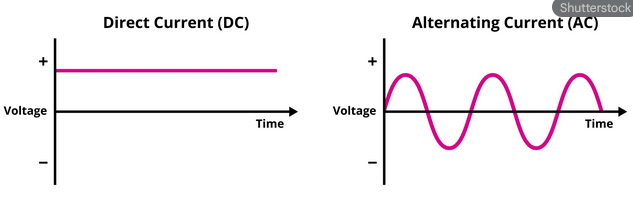

# ΔΙΑΦΟΡΑ
[back](chapter3.3.md)
> ## 1. Volt, Ampere, Ohm, Watt
### Οι «τρεις σωματοφύλακες» του ηλεκτρισμού: η Τάση, η Ένταση και η Αντίσταση

1. **Τάση (V - Voltage)**

    Τι είναι: Η «πίεση» που σπρώχνει τα ηλεκτρόνια να κινηθούν. Χωρίς τάση, το ρεύμα δεν πάει πουθενά.

    Παρομοίωση: Φαντάσου μια αντλία νερού ή το ύψος μιας δεξαμενής. Όσο πιο ψηλά είναι η δεξαμενή, τόσο μεγαλύτερη πίεση (τάση) έχει το νερό που κατεβαίνει.

    Μονάδα μέτρησης: **Volt (V)**.

2. **Ένταση (I - Current)**

    Τι είναι: Η «ποσότητα» του ηλεκτρισμού που περνάει από ένα σημείο σε ένα δευτερόλεπτο. Είναι η ροή.

    Παρομοίωση: Είναι η ποσότητα του νερού που τρέχει μέσα στον σωλήνα. Πολύ νερό = μεγάλη ένταση, λίγες σταγόνες = μικρή ένταση.

    Μονάδα μέτρησης: **Ampere (A)**.

3. **Αντίσταση (R - Resistance)**

    Τι είναι: Η δυσκολία που συναντά το ρεύμα καθώς περνάει μέσα από ένα υλικό (π.χ. μια λάμπα ή ένα καλώδιο).

    Παρομοίωση: Φαντάσου μια στενωπό στον σωλήνα ή μια περιοχή γεμάτη πέτρες. Το νερό δυσκολεύεται να περάσει από εκεί.

    Μονάδα μέτρησης: **Ohm (Ω)**.

Η σχέση τους: Ο Νόμος του Ohm

Αυτά τα τρία συνδέονται άρρηκτα. Αν αυξήσεις την Τάση (την πίεση), θα αυξηθεί η Ένταση (η ροή). Αν όμως αυξήσεις την Αντίσταση (το εμπόδιο), η Ένταση θα μειωθεί.

### 
 V=I⋅R 

|Στοιχείο	| Σύμβολο |	Μονάδα	|Τι εκφράζει με απλά λόγια|
|:-----| :-----:| :-----: | ------|
|Τάση	| V	|Volt|	Η ηλεκτρική "πίεση"|
|Ένταση	| I	|Ampere|	Η "ποσότητα" της ροής|
|Αντίσταση	| R	|Ohm	|Το "εμπόδιο" στη ροή|

---

4. **Ηλεκτρική Ισχύς (W - WATT)**

    Αν η Τάση είναι η "πίεση" και η Ένταση είναι η "ροή", τα Watt μας λένε πόση δουλειά παράγεται κάθε δευτερόλεπτο.

    Συνεχίζοντας την παρομοίωση με το νερό:

        Volt (Τάση): Η πίεση του νερού.

        Ampere (Ένταση): Πόσο νερό τρέχει.

        Watt (Ισχύς): Πόσο γρήγορα μπορεί αυτό το νερό να γυρίσει έναν νερόμυλο!

Πώς υπολογίζονται τα Watt;

Είναι το γινόμενο της Τάσης επί την Ένταση. Ο τύπος είναι πολύ απλός:

### 
 P=V⋅I 

(Όπου P είναι η Ισχύς σε Watt, V η Τάση σε Volt και I η Ένταση σε Ampere).

Παράδειγμα:
Αν μια συσκευή δουλεύει στα 230V (η πρίζα του σπιτιού) και τραβάει ρεύμα 2Α, τότε η ισχύς της είναι:

**230⋅2=460 Watt**
---

> ## 2. AC-DC

Η βασική διαφορά μεταξύ AC (Εναλλασσόμενο Ρεύμα) και DC (Συνεχές Ρεύμα) βρίσκεται στην κατεύθυνση προς την οποία κινούνται τα ηλεκτρόνια μέσα σε έναν αγωγό (όπως ένα καλώδιο).

  

### 1. DC (Direct Current) – Συνεχές Ρεύμα

Στο DC, τα ηλεκτρόνια κινούνται μόνο προς μία κατεύθυνση, σαν ένα ποτάμι που ρέει σταθερά από το σημείο Α στο σημείο Β.
- Πηγή: Μπαταρίες, φωτοβολταϊκά πάνελ, δυναμό.
- Χρήση: Σχεδόν όλες οι ηλεκτρονικές συσκευές (κινητά, laptop, τηλεοράσεις) λειτουργούν εσωτερικά με DC.
- Χαρακτηριστικό: Η τάση παραμένει σταθερή με την πάροδο του χρόνου.
--- 

### 2. AC (Alternating Current) – Εναλλασσόμενο Ρεύμα

Στο AC, τα ηλεκτρόνια δεν προχωράνε μπροστά, αλλά ταλαντώνονται (πηγαίνουν μπρος-πίσω) πολύ γρήγορα. Στην Ευρώπη, αυτή η αλλαγή κατεύθυνσης γίνεται 50 φορές το δευτερόλεπτο (50 Hz).
* Πηγή: Πρίζες τοίχου, γεννήτριες εργοστασίων παραγωγής ενέργειας.
* Χρήση: Μεταφορά ενέργειας σε μεγάλες αποστάσεις (από το εργοστάσιο στο σπίτι σου) και μεγάλες συσκευές (ψυγεία, πλυντήρια).
* Χαρακτηριστικό: Η τάση ανεβοκατεβαίνει σαν κύμα.

---

|Χαρακτηριστικό	|AC (Εναλλασσόμενο)	|DC (Συνεχές)|
|:---|:---:|:---:|
|Μεταφορά	|Ιδανικό για μεγάλες αποστάσεις με μικρές απώλειες.|	Δύσκολη μεταφορά σε μεγάλες αποστάσεις.|
|Αποθήκευση	|Δεν μπορεί να αποθηκευτεί σε μπαταρίες.|	Μπορεί να αποθηκευτεί εύκολα.|
|Μετατροπή	|Η τάση αλλάζει εύκολα με έναν μετασχηματιστή.	|Η αλλαγή τάσης είναι πιο περίπλοκη.|

---
> * **Με απλά λόγια:** Το AC είναι ο τρόπος που το ρεύμα "ταξιδεύει" από το εργοστάσιο μέχρι το σπίτι σου, ενώ το DC είναι ο τρόπος που το ρεύμα "τροφοδοτεί" τις ευαίσθητες πλακέτες των συσκευών σου.*

---

> ## Γωνία τάσης (voltage angle θ) 

Στην ανάλυση συστημάτων ισχύος, η γωνία τάσης (voltage angle), θ, είναι ένα από τα πιο κρίσιμα μεγέθη, καθώς αποτελεί τον «κινητήριο μοχλό» που καθορίζει τη ροή της πραγματικής ισχύος (P) ανάμεσα σε δύο σημεία του δικτύου.

Ακολουθεί η ανάλυση της σημασίας της, ειδικά στο πλαίσιο του PyPSA:

#### 1 Η Φυσική Σημασία της Γωνίας θ
Στο εναλλασσόμενο ρεύμα (AC), η τάση δεν είναι ένας απλός αριθμός, αλλά ένα διάνυσμα (φασέτο) που έχει μέτρο (∣V∣) και γωνία (θ).
* Η γωνία θ εκφράζει τη χρονική «μετατόπιση» της κυματομορφής της τάσης σε έναν ζυγό σε σχέση με έναν ζυγό αναφοράς (Slack Bus).
* Αν δύο ζυγοί έχουν την ίδια ακριβώς γωνία, δεν υπάρχει ροή ισχύος μεταξύ τους, ακόμα και αν η τάση τους είναι πολύ υψηλή.

#### 2. Η Σχέση Γωνίας και Ροής Ισχύος
Η ροή της πραγματικής ισχύος (P) από τον ζυγό A στον ζυγό B εξαρτάται άμεσα από τη διαφορά των γωνιών τους (Δθ=θA​−θB​).
- Στη γραμμική προσέγγιση (DC Power Flow), που αποτελεί τη βάση του PyPSA, η σχέση αυτή περιγράφεται από την εξίσωση:

### 
 fAB,t​=​(θA,t​−θB,t​)/xAB​​ 

Όπου XAB​ είναι η επαγωγική αντίδραση (reactance) της γραμμής.

Βασικοί Κανόνες:
* η γωνία (από εκεί που η γωνία «προηγείται» προς εκεί που «έπεται»).
* Όσο μεγαλύτερη είναι η διαφορά θA​−θB​, τόσο μεγαλύτερη είναι η ποσότητα ενέργειας που μεταφέρεται.
* Αν η γωνία στον ζυγό A αυξηθεί (π.χ. λόγω έγχυσης ισχύος από μια γεννήτρια), η ισχύς θα «σπρωχτεί» προς το υπόλοιπο δίκτυο.

### 3. Γιατί είναι απαραίτητος ο Ζυγός Αναφοράς (Slack Bus);

Επειδή η ροή εξαρτάται από τη διαφορά των γωνιών, χρειαζόμαστε ένα σημείο μηδενισμού.
- Φαντάσου το σαν το υψόμετρο: για να πούμε ότι ένα βουνό είναι 1000 μέτρα, χρειαζόμαστε το επίπεδο της θάλασσας ως 0.
- Στα συστήματα ισχύος, ορίζουμε έναν ζυγό (Slack Bus) με θ=0∘. Όλες οι άλλες γωνίες στο σύστημα υπολογίζονται σε σχέση με αυτόν.

### 4. Η σημασία της γωνίας στην Ευστάθεια

Στην εργασία σου, μπορείς να αναφέρεις ότι η γωνία θ είναι δείκτης της «φόρτισης» του συστήματος:
- Μικρές διαφορές γωνιών: Υποδηλώνουν ένα δίκτυο που λειτουργεί άνετα, χωρίς μεγάλες καταπονήσεις.
- Μεγάλες διαφορές γωνιών: Υποδηλώνουν ότι οι γραμμές μεταφέρουν ισχύ κοντά στα όριά τους. Αν η γωνία αυξηθεί υπερβολικά (συνήθως πάνω από 30∘ - 40∘ για μια γραμμή), το σύστημα κινδυνεύει να χάσει τον συγχρονισμό του και να οδηγηθεί σε κατάρρευση (instability).

---
> *Η γωνία τάσης θ αποτελεί την κατάσταση λειτουργίας που καθορίζει τη δυναμική των ροών ισχύος στο δίκτυο. Στο μοντέλο DC Power Flow του PyPSA, οι γωνίες των ζυγών είναι οι κύριες μεταβλητές απόφασης. Η χωρική κατανομή των γωνιών αντανακλά την ισορροπία παραγωγής-ζήτησης και η διαφορά τους κατά μήκος των κλάδων του δικτύου ορίζει την κατεύθυνση και το μέγεθος της μεταφερόμενης πραγματικής ισχύος.*

---

