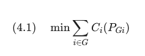

## 4.4 OPF

### 4.4.2 ΔΙΑΜΟΡΦΩΣΗ ΚΑΙ ΔΟΜΗ 

Το OPF (Optimal Power Flow) είναι ένα σύνθετο μαθηματικό πρόβλημα βελτιστοποίησης.

1. ΑΝΤΙΚΕΙΜΕΝΙΚΗ ΣΥΝΑΡΤΗΣΗ 

Το ζητούμενο είναι το ελάχιστο κόστος.

  

- Τι λέει: "Βρες τον συνδυασμό παραγωγής που μας δίνει το μικρότερο άθροισμα κόστους".

- Ci​: Το κόστος της γεννήτριας i.

- PGi​: Η ισχύς (MW) που παράγει η γεννήτρια i.

> Σημείωση: Στο PyPSA, αν ορίσεις marginal_cost, η συνάρτηση είναι γραμμική. Αν ορίσεις και δευτεροβάθμιους όρους, γίνεται κυρτή (convex) για μεγαλύτερη ακρίβεια.

---

2. ΙΣΟΖΥΓΙΟ ΙΣΧΥΟΣ

Αυτός είναι ο νόμος που δεν μπορεί να παραβιαστεί ποτέ: η παραγωγή πρέπει να ισούται με τη ζήτηση.

  

- Τι λέει: "Όσο ρεύμα παράγουμε (αριστερά), τόσο πρέπει να καταναλώνουμε συν τις απώλειες (δεξιά)".

- PDj​: Το φορτίο (ζήτηση) κάθε καταναλωτή j.

- Ploss​: Οι απώλειες στις γραμμές. Στο AC OPF (εναλλασσόμενο ρεύμα) οι απώλειες είναι μη γραμμικές, γεγονός που κάνει το πρόβλημα πολύ δύσκολο στην επίλυση. Στο DC OPF (ή LOPF) που χρησιμοποιεί συχνά το PyPSA, οι απώλειες συχνά αγνοούνται ή γραμμικοποιούνται για ταχύτητα.

---

3. ΤΕΧΝΙΚΟΙ ΠΕΡΙΟΡΙΣΜΟΙ (Box Constraints)

Κάθε μηχάνημα έχει όρια. Μια γεννήτρια 100 MW δεν μπορεί να παράγει 150 MW, ούτε -10 MW.

  

Τι λέει: "Για κάθε γεννήτρια i, η παραγωγή της πρέπει να βρίσκεται ανάμεσα στο ελάχιστο και το μέγιστο όριό της".

PGimax​: Η ονομαστική ισχύς (p_nom στο PyPSA).

PGimin​: Συχνά είναι 0, αλλά για θερμικές μονάδες (π.χ. λιγνίτη) μπορεί να είναι π.χ. 30 MW γιατί δεν μπορούν να δουλέψουν πιο χαμηλά χωρίς να σβήσουν.

---

Γιατί είναι δύσκολο; (Computational Complexity)

Αν και οι παραπάνω τύποι φαίνονται απλοί, το πρόβλημα γίνεται "βουνό" γιατί:

    Μη γραμμικότητα: Στο πραγματικό δίκτυο (AC), οι ροές εξαρτώνται από ημίτονα και συνημίτονα των γωνιών τάσης.

    Μέγεθος: Σε ένα δίκτυο με 5.000 κόμβους και 10.000 γραμμές, οι εξισώσεις είναι χιλιάδες.

    Μη κυρτότητα (Non-convexity): Υπάρχει κίνδυνος ο solver να βρει μια "καλή" λύση (τοπικό ελάχιστο) αλλά να χάσει την "τέλεια" λύση (ολικό ελάχιστο).

---

[<-- back](chapter4.md)